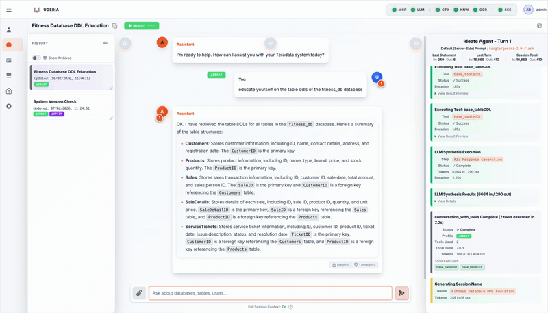

# Uderia Platform - Your Trusted Data Agent
### Cloud-Level Reasoning. Zero-Trust Privacy.

The **Uderia Platform** delivers enterprise-grade AI orchestration with unmatched flexibility. Whether you leverage hyperscaler intelligence for maximum capability, run private local models for absolute sovereignty, or blend both approaches, you get cloud-level reasoning with complete control over your data and costs.

Experience a fundamental transformation in how you work with enterprise data:

- **From Intent to Autonomy** - Your AI organization that senses, reasons, and delivers. Stop orchestrating. Start delegating. Specialized agents coordinate autonomously to gather data, reason across domains, and synthesize actionable intelligence.
- **From Ideation to Operationalization** - Revolutionary IFOC Methodology adapts to your needs. Four execution modes (Ideate, Focus, Optimize, Coordinate) in one conversation with zero friction. Switch between creative ideation, document-verified answers, sovereign efficiency, and cross-team orchestration with a simple @TAG.
- **From Days to Seconds** - Discover insights via conversation. Operationalize them via API. Your conversational discovery is your production-ready automation.
- **From Guesswork to Clarity** - Full transparency eliminates the AI black box. See every strategic plan, tool execution, and self-correction in real-time through the Live Status Window.
- **From Uncertainty to Accountability** - Every action recorded. Every decision traceable. Enterprise-grade audit logging captures every interaction with full forensic context for compliance (GDPR, SOC2) and accountability at scale.
- **From Data Exposure to Data Sovereignty** - Your data, your rules, your environment. Execute with cloud intelligence while maintaining local privacy through decoupled planning and execution with Champion Cases.
- **From $$$ to ¢¢¢** - Revolutionary Fusion Optimizer with strategic planning, proactive optimization, and autonomous self-correction for cost-effective execution.
- **From Hidden Costs to Total Visibility** - Complete financial governance with real-time tracking, comprehensive analytics, and fine-grained cost control. Track every token, understand every cost.

Whether on-premises or in the cloud, you get **enterprise results** with **optimized speed** and **minimal token cost**, built on the six core principles detailed below.



---


### Table Of Contents

1. [Core Principles: A Superior Approach](#core-principles-a-superior-approach)
2. [Key Features](#-key-features)
3. [Core Components](#-core-components)
   - [Profile Classes: The IFOC Workflow](#-profile-classes-the-ifoc-workflow)
   - [The Fusion Optimizer](#-the-heart-of-the-application---the-engine--its-fusion-optimizer)
   - [Retrieval-Augmented Generation (RAG)](#-retrieval-augmented-generation-rag-for-self-improving-ai)
   - [Skills: Pre-Processing Context Injection](#-skills-pre-processing-context-injection)
   - [Extensions: Post-Processing Transformations](#-extensions-post-processing-transformations)
4. [How It Works: Architecture](#%EF%B8%8F-how-it-works-architecture)
5. [Installation and Setup Guide](#-installation-and-setup-guide)
   - [Model Selection: Recommended vs All Models](#model-selection-recommended-vs-all-models)
   - [Command Line Options](#command-line-options)
6. [User Guide](#-user-guide)
   - [Getting Started](#getting-started)
   - [Using the Interface](#using-the-interface)
   - [Advanced Context Management](#advanced-context-management)
   - [REST API Integration](#rest-api-integration)
   - [Real-Time Monitoring](#real-time-monitoring)
   - [Operationalization](#operationalization)
   - [Troubleshooting](#troubleshooting)
7. [Docker Deployment](#docker-deployment)
8. [License](#license)
9. [Author & Contributions](#author-contributions)
10. [Appendix: Feature Update List](#appendix-feature-update-list)


---

## Core Principles: A Superior Approach

The Uderia Platform transcends typical data chat applications by delivering a seamless and powerful experience based on six core principles:

### 🚀 Actionable
Go from conversational discovery to a production-ready, automated workflow in seconds. The agent's unique two-in-one approach means your interactive queries can be immediately operationalized via a REST API, eliminating the friction and redundancy of traditional data operations. What once took data experts weeks is now at your fingertips.

### 🔍 Transparent
Eliminate the "black box" of AI. The Uderia Platform is built on a foundation of absolute trust, with a Live Status Window that shows you every step of the agent's thought process. From the initial high-level plan to every tool execution and self-correction, you have a clear, real-time view, leaving no room for guesswork.

### ⚡ Efficient
Powered by the intelligent Fusion Optimizer, the agent features a revolutionary multi-layered architecture for resilient and cost-effective task execution. Through strategic and tactical planning, proactive optimization, and autonomous self-correction, the agent ensures enterprise-grade performance and reliability.

### 🛡️ Sovereignty
Your data, your rules, your environment. The agent gives you the ultimate freedom to choose your data exposure strategy. Leverage the power of hyperscaler LLMs, or run fully private models on your own infrastructure with Ollama, keeping your data governed entirely by your rules. The agent connects to the models you trust.

### 💰 Financial Governance
Complete cost transparency and control over your LLM spending. The agent provides real-time cost tracking, comprehensive analytics, and detailed visibility into every token consumed. With accurate per-model pricing, cost attribution by provider, and powerful administrative tools, you maintain full financial oversight of your AI operations.

### 🤝 Collaborative
Transform isolated expertise into collective intelligence. The Intelligence Marketplace enables you to share proven execution patterns and domain knowledge with the community, subscribe to curated collections from experts, and fork specialized repositories for your unique needs. By leveraging community-validated RAG collections, you reduce token costs, accelerate onboarding, and benefit from battle-tested strategies—turning individual insights into a powerful, shared ecosystem.

[⬆️ Back to Table of Contents](#table-of-contents)

---

## 🌟 Key Features

The Uderia Platform's features are organized around the six core principles that define its value proposition. Each principle is realized through a comprehensive set of capabilities designed to deliver enterprise-grade AI orchestration.

---

### 🚀 Actionable: From Discovery to Production in Seconds

Eliminate the friction between conversational exploration and production automation. The agent's unique architecture enables seamless operationalization of interactive queries.

* **Comprehensive REST API**: Full programmatic control with asynchronous task-based architecture for reliable, scalable automation:
  - Session management (create, delete, list with conversation history)
  - Query execution with async submit + poll pattern
  - Task management (status polling, cancellation, result retrieval)
  - Configuration management (profiles, LLM providers, MCP servers)
  - RAG collection CRUD operations
  - Analytics endpoints (session costs, token usage, efficiency metrics)

* **Long-Lived Access Tokens**: Secure automation without session management:
  - Configurable expiration (90 days default, or never)
  - SHA256 hashed storage with audit trail
  - Usage tracking (last used timestamp, use count, IP address)
  - Soft-delete preservation for compliance
  - One-time display at creation for enhanced security

* **Apache Airflow Integration**: Production-ready DAG examples for batch query automation:
  - Session reuse via `tda_session_id` variable
  - Profile override via `tda_profile_id` for specialized workloads
  - Bearer token authentication for secure API access
  - Async polling pattern for reliable long-running executions
  - Complete example DAG (`tda_00_execute_questions.py`) included

* **n8n Workflow Automation**: Visual node-based workflow builder for enterprise automation:
  - Three production-ready workflow templates (Simple Query, Scheduled Reports, Slack Integration)
  - Profile override support via REST API `profile_id` parameter
  - Event-driven triggers (webhooks, cron schedules, manual execution)
  - Linear ultra-clean workflow pattern for reliability
  - Business process routing (email, Slack, CRM, databases)
  - Docker deployment with reverse proxy support
  - Comprehensive documentation with troubleshooting guides ([see docs/n8n](docs/n8n/README.md))

* **Flowise Integration**: Low-code workflow automation and chatbot development:
  - Pre-built agent flow for TDA Conversation handling
  - Asynchronous submit & poll pattern implementation
  - Session management with multi-turn conversation support
  - Bearer token authentication for secure API access
  - Profile override capability for specialized workflows
  - TTS payload extraction for voice-enabled chatbots
  - Visual workflow designer for complex orchestration
  - Import-ready JSON template included ([see docs/Flowise](docs/Flowise/Flowise.md))

* **IFOC Workflow - From Ideation to Operationalization**: Revolutionary methodology that adapts to your needs—four execution modes in one conversation with zero friction:
  - **🟢 IDEATE (Conversation)**: Brainstorm, explore, and draft solutions without touching live systems—creative ideation without constraints
  - **🔵 FOCUS (Knowledge)**: Verified intelligence with zero-hallucination guarantee—every answer grounded in your documents for document-verified answers
  - **🟠 OPTIMIZE (Efficiency)**: The powerhouse—Fusion Optimizer with full MCP Tools + Prompts support, strategic planning, and self-correction for sovereign efficiency
  - **🟣 COORDINATE (Multi-Profile)**: Multi-level autonomous orchestration where coordinators manage specialist teams for cross-team orchestration
  - Switch between modes instantly with a simple `@TAG` (e.g., `@CHAT`, `@POLICY`, `@OPTIMIZER`, `@EXECUTIVE`)
  - Temporary overrides via `@TAG` syntax for single queries without changing defaults
  - Nested coordination support: Build 3-level AI hierarchies (Master → Coordinators → Specialists)
  - Complete safeguards: Circular dependency detection, depth limits, cost visibility at every level
  - Stop force-fitting every problem into one AI—match your intent to the right intelligence phase

* **Autonomous AI Organization (Genie Mode)**: From intent to autonomy—your AI organization that senses, reasons, and delivers:
  - Multi-profile coordination where specialized agents work as a unified team
  - Master coordinator intelligently routes queries to domain experts
  - Automatic discovery and orchestration of specialist capabilities
  - Cross-domain synthesis: agents gather data independently, then coordinate findings
  - Real-time topology visualization showing agent activation and collaboration
  - Stop orchestrating manually—start delegating to an AI organization that never sleeps
  - Executive-level queries like "Improve Product Margin for Q4" automatically cascade to CFO, CMO, and Legal specialists

* **MCP Server Import with Dual Format Support**: Seamless integration of community MCP servers:
  - Import from official MCP Registry format (io.example/server-name specifications)
  - Import from Claude Desktop configuration files (direct migration)
  - Automatic format detection with validation
  - Bulk import multiple servers at once
  - Three transport types: 🟠 STDIO (local), 🔵 HTTP (network), 🟢 SSE (streaming)
  - STDIO servers: automatic subprocess lifecycle management (npx, uvx, python)
  - Server-side ID generation ensures uniqueness
  - Duplicate detection prevents configuration conflicts
  - One-click access to [MCP community servers](https://github.com/modelcontextprotocol/servers)

* **Docker Deployment Support**: Production-ready containerization:
  - Multi-user support in single shared container
  - Environment variable overrides
  - Volume mounts for sessions, logs, and keys
  - Load balancer ready for horizontal scaling

---

### 🔍 Transparent: Eliminate the AI Black Box

Build trust through complete visibility into every decision, action, and data point the agent processes.

* **Live Status Panel**: Real-time window into the agent's reasoning process:
  - Strategic plan visualization with phase-by-phase breakdown
  - Tactical decision display showing tool selection rationale
  - Raw data inspection for every tool response
  - Self-correction events with recovery strategy visibility
  - Streaming updates via Server-Sent Events (SSE)
  - Dual-model cost breakdown for Fusion Optimizer showing strategic vs tactical costs with color-coded visualization (12-Feb-2026)

* **Dynamic Capability Discovery**: Instant overview of agent potential:
  - Automatic loading of all MCP Tools from connected servers
  - Prompt library display with categorization
  - Resource enumeration for data source visibility
  - Real-time capability updates on configuration changes
  - Visual organization in tabbed Capabilities Panel

* **Rich Data Rendering**: Intelligently formats and displays various data types:
  - Query results in interactive tables with sorting/filtering
  - SQL DDL in syntax-highlighted code blocks
  - Key metrics in summary cards
  - Integrated charting engine for data visualization
  - Real-time rendering as data streams in

* **Comprehensive Token Tracking**: Per-turn visibility into LLM consumption:
  - Input token counts for every request
  - Output token counts for every response
  - Token-to-cost mapping with provider-specific pricing
  - Historical token trends across sessions
  - Optimization insights for cost-conscious users
  - Theme-aware KPI displays adapt seamlessly to dark and light themes (11-Feb-2026)

* **Execution Monitoring Dashboard**: Cross-source workload tracking:
  - Real-time task list (running, completed, failed)
  - Detailed execution logs with reasoning steps
  - Tool invocation history with arguments and responses
  - Error messages and stack traces for debugging
  - Task control (cancel, retry) for operational flexibility

* **Enterprise Audit Logging - From Uncertainty to Accountability**: Every action recorded, every decision traceable:
  - Complete forensic trail with user, IP, timestamp, and outcome for every interaction
  - User authentication and authorization events (login attempts, OAuth flows, token generation)
  - Configuration changes with before/after snapshots (LLM provider switches, profile updates)
  - Prompt executions with full turn-level attribution and cost tracking
  - API usage patterns and access history for security monitoring
  - Admin actions on user accounts and system settings
  - Progressive security lockouts and suspicious activity detection
  - 20+ specialized logging functions for comprehensive coverage
  - Configurable retention policies for GDPR and data sovereignty compliance
  - REST API access for integration with compliance tools (SOC2, audit reports)
  - From audit trail to compliance report in one click

* **Intelligent Context Window Management**: Budget-aware orchestration of every token sent to the LLM:
  - Modular architecture with 9 pluggable context modules (system prompt, tools, history, RAG, knowledge, documents, and more)
  - Five-pass assembly pipeline: resolve → dynamic adjustments → allocate & assemble → surplus reallocation → condense
  - Per-module budget allocation with min/max constraints and priority-based condensation
  - Dynamic adjustment rules that adapt context composition at runtime (first turn, long conversations, high-confidence RAG)
  - Real-time observability via context window snapshot events with per-module utilization metrics
  - 4 predefined context window types (Balanced, Knowledge-Heavy, Conversation-First, Token-Efficient) plus custom types
  - Admin UI with live budget visualization, condensation order editor, and dynamic rule builder
  - Per-session utilization analytics dashboard with trend charts and module breakdown
  - tiktoken-based BPE token estimation for accurate budget planning
  - [Full architecture documentation →](docs/Architecture/CONTEXT_WINDOW_ARCHITECTURE.md)

* **System Customization**: Take control of agent behavior:
  - System Prompt Editor for per-model instruction customization
  - Save and reset capabilities for experimentation
  - Direct Model Chat for baseline testing without tools
  - Dynamic Capability Management (enable/disable tools/prompts)
  - Phased rollouts without server restart

---

### ⚡ Efficient: Intelligent Optimization Engine

The Fusion Optimizer delivers enterprise-grade performance, cost efficiency, and reliability.

**Real-World Cost Savings:**

- **Typical enterprise query**: "Show me all products with low inventory and notify suppliers"
  - Traditional LLM wrapper: 15,000 tokens (full schema + full history) = $0.45/query
  - Fusion Optimizer: 6,000 tokens (plan hydration + tactical fast path) = $0.18/query
  - **60% cost reduction** on repeated similar queries

- **Monthly workload** (500 queries/day):
  - Traditional: 500 × $0.45 × 30 = $6,750/month
  - Fusion Optimizer: 500 × $0.18 × 30 = $2,700/month
  - **Savings: $4,050/month ($48,600/year)**

- **Self-correction efficiency**: When errors occur, targeted replanning (2K tokens) vs full restart (15K tokens)

See the dedicated section below (**[The Heart of the Application - The Engine & its Fusion Optimizer](#the-heart-of-the-application---the-engine-its-fusion-optimizer)**) for comprehensive architectural details on:

* Multi-layered strategic and tactical planning
* Proactive optimization (Plan Hydration, Tactical Fast Path, Specialized Orchestrators)
* Autonomous self-correction and healing
* Context-aware learning from execution history
* Deterministic plan validation and hallucination prevention

**Key efficiency highlights:**

* **Self-Improving Learning System**: Closed-loop learning from past successes:
  - Automatic capture and archiving of all successful interactions
  - Token-based efficiency analysis to identify "champion" strategies
  - Few-shot learning through injection of best-in-class examples
  - Asynchronous processing to eliminate user-facing latency
  - Per-user cost savings attribution and tracking

* **Planner Repository Constructors**: Modular plugin system for domain-specific optimization:
  - Self-contained templates with validation schemas
  - SQL query templates with extensibility for document Q&A, API workflows
  - LLM-assisted auto-generation from database schemas
  - Dynamic runtime registration from `rag_templates/` directory
  - Programmatic population via REST API for CI/CD integration

* **Knowledge Repositories**: Domain context injection for better planning:
  - PDF, TXT, DOCX, MD document support
  - Configurable chunking strategies (fixed-size, paragraph, sentence, semantic)
  - Automatic retrieval during strategic planning for context-aware decisions
  - Semantic search for relevant background information
  - Marketplace integration for community knowledge sharing

---

### 🛡️ Sovereignty: Your Data, Your Rules, Your Environment

Maintain complete control over your data exposure strategy with flexible deployment and provider options.

* **Multi-Provider LLM Support**: Freedom to choose your AI infrastructure:
  - **Cloud Hyperscalers**: Google (Gemini), Anthropic (Claude), OpenAI (GPT-4o), Azure OpenAI
  - **AWS Bedrock**: Foundation models and inference profiles for custom/provisioned models
  - **Friendli.AI**: High-performance serverless and dedicated endpoint support
  - **Ollama**: Fully local, offline LLM execution on your own infrastructure
  - Dynamic provider switching without configuration restart
  - Live model refresh to fetch latest available models

* **Comparative LLM Testing**: Validate model behavior across providers:
  - Identical MCP tools and prompts across different LLMs
  - Side-by-side performance comparison
  - Model capability robustness validation
  - Direct model chat for baseline reasoning assessment
  - Profile-based A/B testing with `@TAG` overrides

* **Encrypted Credential Storage**: Enterprise-grade security:
  - Fernet symmetric encryption for all API keys
  - Per-user credential isolation in SQLite database
  - Credentials never logged or exposed in UI/API responses
  - Secure passthrough to LLM/MCP providers
  - Admin oversight without credential access

* **Multi-User Isolation**: Complete session and data segregation:
  - JWT-based authentication with 24-hour expiry
  - User-specific sessions in separate directories
  - Database-level user UUID isolation
  - Role-based access control (User, Developer, Admin)
  - Simultaneous multi-user support with no cross-contamination

* **Flexible Deployment Options**: Adapt to your infrastructure:
  - Single-user development (local Python process)
  - Multi-user production (load-balanced containers or shared instance)
  - HTTPS support via reverse proxy configuration
  
  - Docker volume mounts for persistent data

* **Voice Conversation Privacy**: Optional Google Cloud TTS with user-provided credentials:
  - User-controlled API key management
  - No server-side credential storage for voice features
  - Browser-based Speech Recognition (local processing)
  - Hands-free operation with configurable voice modes
  - Key observations handling (autoplay-off, autoplay-on, off)

* **Document Upload & Multimodal Analysis**: Attach documents and images directly in chat conversations:
  - Native multimodal delivery for capable providers (Google Gemini, Anthropic Claude, OpenAI GPT-4o, Azure, AWS Bedrock Claude)
  - Automatic text extraction fallback for all other providers (Friendli, Ollama, Bedrock Nova)
  - Supports PDF, DOCX, TXT, MD, and image formats (JPG, PNG, GIF, WebP)
  - Drag-and-drop or click-to-attach with image thumbnail previews and Visual/Text processing badges
  - Provider-aware routing: images sent natively to vision models, documents via base64 or text extraction as appropriate
  - Up to 5 files per message, 50 MB per file
  - Full REST API support for programmatic upload workflows

* **Decoupled Planning with Champion Cases - The Sovereignty Breakthrough**: Uderia separates strategic intelligence from execution, enabling local models to perform like hyperscalers.

  **How It Works:**
  1. **Cloud Planning Phase**: Hyperscaler LLM creates strategic plan using full reasoning capability
  2. **Champion Case Injection**: System retrieves proven execution patterns from organizational history
  3. **Local Execution Phase**: Private on-prem model (Ollama) executes plan with champion guidance

  **Result**: Your data never leaves your infrastructure, yet you get cloud-level strategic thinking.

  **Example Workflow:**
  - Query: "Analyze Q4 customer churn by segment"
  - Cloud Planner: Creates 3-phase strategy (retrieve data, segment analysis, visualize)
  - Champion Cases: Injects 5 proven churn analysis patterns from past successes
  - Local Executor: Runs analysis on your private database using proven patterns
  - Zero cloud exposure, maximum intelligence

  **Business Impact:**
  - Regulatory compliance: PHI, PII, financial data stays local
  - Cost optimization: Expensive planning calls (8K tokens) happen once; cheap execution (2K tokens) reuses patterns
  - Best of both worlds: Hyperscaler reasoning + on-prem sovereignty

---

### 💰 Financial Governance: Track Every Penny, Control Every Cost

Transparent, real-time cost tracking with fine-grained control over spending at every level of abstraction.

* **Real-Time Cost Tracking**: Per-interaction visibility:
  - Automatic cost calculation using up-to-date provider pricing
  - Per-turn breakdown (input tokens, output tokens, total cost)
  - Session-level cumulative cost tracking
  - User-level cost aggregation across all sessions
  - Historical cost trends and analytics

* **Provider-Specific Pricing Models**: Accurate cost attribution:
  - Google Gemini (1.5 Pro, 1.5 Flash, etc.) with context length tiers
  - Anthropic Claude (Opus, Sonnet, Haiku) with standard/batch pricing
  - OpenAI GPT-4o and GPT-4o-mini with tiered pricing
  - Azure OpenAI (GPT-4, GPT-3.5-Turbo) with regional pricing
  - AWS Bedrock (foundation models, inference profiles)
  - Friendli.AI serverless and dedicated endpoints
  - Ollama (local models, zero external cost)

* **Database-Backed Cost Persistence**: Complete financial audit trail:
  - `llm_model_costs` table with versioned pricing
  - `efficiency_metrics` table tracking token usage and learning system savings
  - `user_sessions` table with per-session cost summaries
  - `long_lived_access_tokens` with usage tracking
  - Exportable cost reports for budgeting and forecasting

* **Profile-Based Spending Controls**: Optimize costs by workload:
  - Tag profiles by cost characteristics (e.g., "COST" for Gemini Flash)
  - Quick switching between expensive (Claude Opus) and economical (Gemini Flash) models
  - Profile override via `@TAG` syntax for cost-conscious queries
  - REST API profile selection for automated cost optimization

* **Efficiency Attribution**: Quantify learning system savings:
  - Before/after token comparison for champion case-guided planning
  - Estimated cost savings from few-shot learning
  - Per-user attribution of efficiency gains
  - Efficiency leaderboard for gamification
  - Continuous improvement ROI visibility

* **Cost Optimization Recommendations**: Actionable insights:
  - Model selection guidance based on task complexity
  - Context pruning opportunities for token reduction
  - Champion case population priorities for maximum savings
  - Profile configuration suggestions for workload patterns

* **Consumption Profile Enforcement**: Granular usage controls and quotas:
  - Four predefined tiers: Free, Pro, Enterprise, Unlimited
  - Per-user prompt rate limits (hourly and daily)
  - Monthly token quotas (input and output tokens separately)
  - Configuration change rate limits per hour
  - Profile activation/deactivation for testing
  - Global override mode for emergency rate limiting
  - Admin bypass for unrestricted system access
  - Real-time enforcement with clear error messages
  - Database-backed consumption tracking and audit trail

---

### 🤝 Collaborative: Build and Share Intelligence

The Intelligence Marketplace transforms individual agent expertise into collective organizational knowledge.


#### Collaborative Intelligence Marketplace

* **Dual Repository Sharing**: Share and discover both repository types through a unified marketplace:
  - **Planner Repositories (📋):** Proven execution patterns and strategies for task completion
  - **Knowledge Repositories (📄):** Reference documents and domain knowledge for planning context
  - Visual separation with dedicated tabs and distinct badges (blue for Planner, purple for Knowledge)

* **Smart Discovery & Search**: Find exactly what you need through powerful search and filtering:
  - Keyword search across collection names and descriptions
  - Filter by repository type (Planner vs. Knowledge)
  - Filter by visibility (Public, Unlisted)
  - Pagination for browsing large catalogs
  - View metadata: owner, subscriber count, ratings, case/document counts

* **Reference-Based Subscriptions**: Access shared collections without data duplication:
  - Subscribe to expert-curated collections with one click
  - Automatic integration into your RAG system
  - Planner retrieves cases from subscribed collections seamlessly
  - No storage overhead—references original collection
  - Unsubscribe anytime to manage your collection portfolio

* **Fork for Customization**: Create independent copies for your specific needs:
  - Full copy including embeddings, files, and metadata
  - Customize forked collections without affecting originals
  - Perfect for adapting community patterns to your domain
  - Iterative refinement through fork-and-improve workflow
  - Build on proven strategies while maintaining independence

* **Community Quality Assurance**: Trust community validation through ratings and reviews:
  - 1-5 star rating system with optional text reviews
  - Average ratings displayed on collection cards
  - Cannot rate own collections (ensures objectivity)
  - Browse top-rated collections for proven quality
  - Community feedback guides collection discovery

* **Flexible Publishing Options**: Share your expertise with granular visibility control:
  - **Public:** Fully discoverable in marketplace browse
  - **Unlisted:** Accessible via direct link only (share with specific teams)
  - **Private:** Owner-only access (default)
  - Update visibility anytime
  - Must have at least 1 RAG case/document to publish
  - Maintain full ownership and control

* **Cost Reduction Through Reuse**: Leverage proven patterns to minimize token consumption:
  - Reuse champion execution strategies instead of trial-and-error
  - Access domain expertise without rebuilding from scratch
  - Community-validated patterns reduce failed attempts
  - Lower onboarding costs for new users and use cases
  - Network effects: more users = more valuable patterns

* **Secure Access Control**: Enterprise-grade authorization and privacy:
  - JWT-authenticated API endpoints
  - Ownership validation on all operations
  - Cannot subscribe to own collections
  - Must be owner to publish or modify
  - Usernames visible for transparency and attribution
  - Privacy-first design with granular visibility controls

* **REST API Integration**: Programmatic marketplace operations for automation:
  - Browse collections with search/filter parameters
  - Subscribe/unsubscribe programmatically
  - Fork collections via API for CI/CD workflows
  - Publish collections as part of deployment pipelines
  - Rate collections for automated quality tracking
  - Full CRUD operations for marketplace management

The marketplace transforms the Uderia Platform from a single-user tool into a **collaborative intelligence platform**. By enabling pattern sharing, community validation, and knowledge reuse, it reduces costs, improves quality, and accelerates time-to-value for all users. Whether you're publishing your expertise or subscribing to community wisdom, the marketplace creates a powerful ecosystem where collective intelligence amplifies individual capabilities.


#### Agent Packs: Portable AI Teams

Agent Packs bundle complete agent configurations—coordinator profiles, expert profiles, knowledge collections, and MCP server references—into a single `.agentpack` file that can be installed, exported, and shared across environments.

**Why Agent Packs matter:** Building a well-tuned multi-profile agent team (e.g., a Genie coordinator with specialized RAG experts) requires significant effort: creating profiles, assigning knowledge collections, configuring child relationships, and testing the whole ensemble. Agent Packs capture this investment as a portable, versioned artifact that can be deployed in seconds on any Uderia instance.

**How to use Agent Packs:**

* **Install:** Import an `.agentpack` file via Setup → Agent Packs → Import. All profiles, collections, and dependencies are created automatically with conflict resolution.
* **Export:** Select an installed pack and click Export to produce a `.agentpack` file containing the current live state of all profiles and collections.
* **Publish:** Share your pack to the Intelligence Marketplace for other users to discover and install with one click.
* **Harmonize LLM:** After importing a pack, use the Harmonize LLM feature to switch all pack profiles to your preferred LLM provider in one operation.
* **Live References:** Packs store references to profiles and collections, not copies. Changes you make to pack-managed profiles (e.g., adding an expert to a coordinator) take effect immediately and are captured in subsequent exports.

Agent Packs turn the collaborative marketplace into a distribution channel for complete AI solutions—not just individual knowledge repositories, but fully operational agent teams ready for production use.


#### Bundled MCP Server: Google Search (Gemini Grounded Search)

Uderia ships with a ready-to-use MCP server for public internet search, located at `mcp_servers/google_search.py`. It uses Google's Gemini Grounded Search API to find current public information and return factual summaries with source citations.

**How to activate:**

1. **Import MCP Server** — Navigate to Setup → MCP Servers → Import and paste the following Claude Desktop configuration:
   ```json
   {
     "mcpServers": {
       "Google Search": {
         "command": "python",
         "args": ["/app/mcp_servers/google_search.py"],
         "env": {"GEMINI_API_KEY": "your-gemini-api-key"}
       }
     }
   }
   ```
   Replace `/app/mcp_servers/...` with the actual path if running outside Docker.

2. **Link to a Profile** — Create or edit a profile (e.g., `tool_enabled` type) and select "Google Search" as its MCP Server.

3. **Use** — The `external_search` tool is now available. Queries routed to this profile will search the public internet via Gemini and return results with citations.

Each user provides their own Gemini API key through the `env` field, enabling per-user authentication without shared credentials.

---

## 🧩 Core Components

The platform's capabilities are built on five core components that work together across all profile types — from execution methodology and optimization engine to knowledge retrieval, pre-processing skills, and post-processing extensions.

---

### 🎭 Profile Classes: The IFOC Workflow

The Uderia Platform introduces the **IFOC Workflow**—four distinct execution modes that mirror how experts actually solve problems. From creative exploration to coordinated execution, these modes transform how organizations leverage AI.

#### The IFOC Philosophy: Ideate → Focus → Optimize → Coordinate

```
┌─────────────────────────────────────────────────────────────────────────────────┐
│                           THE IFOC WORKFLOW                                     │
├─────────────────────────────────────────────────────────────────────────────────┤
│                                                                                 │
│   🟢 IDEATE          🔵 FOCUS           🟠 OPTIMIZE        🟣 COORDINATE        │
│   ─────────          ───────           ──────────        ────────────          │
│   Brainstorm         Research          Execute           Orchestrate           │
│   Explore            Verify            Deliver           Scale                 │
│   Draft              Ground            Operate           Synthesize            │
│                                                                                 │
│   "What if...?"      "What does        "Do it."          "Handle              │
│                       policy say?"                        everything."         │
│                                                                                 │
└─────────────────────────────────────────────────────────────────────────────────┘
```

Every profile belongs to one of four classes, each designed for a specific phase of intelligent work. Together, they create a composable AI architecture that adapts to any challenge.

---

##### 1. 🟢 IDEATE - Conversation Focused (LLM)

**Philosophy: Creative exploration without constraints**

```
┌─────────────────────────────────────────┐
│  User Question                          │
│  "How do I optimize this query?"        │
└──────────────┬──────────────────────────┘
               │
               ▼
         ┌──────────┐
         │   LLM    │  ← No tools, no data access
         │ Analysis │  ← Pure reasoning & guidance
         └─────┬────┘
               │
               ▼
┌──────────────────────────────────────────┐
│  Expert Advice + Code Examples           │
│  Ready for review before execution       │
└──────────────────────────────────────────┘
```

**The Value:**
Transform your LLM into a trusted thought partner. Explore possibilities, brainstorm solutions, and draft approaches—all without touching live systems. The **Ideate** phase is where creativity flows freely.

**When to Use IDEATE:**
- **Exploring new ideas**: "What approaches could solve this problem?"
- **Learning concepts**: "Explain CTEs in SQL with examples"
- **Drafting solutions**: "Write a query to calculate customer lifetime value"
- **Planning ahead**: "What should I consider before migrating this database?"

**Breakthrough Potential:**
- **Zero-Cost Exploration**: Learn complex concepts without expensive tool invocations
- **Rapid Prototyping**: Draft SQL, APIs, and workflows before committing resources
- **Risk-Free Testing**: Validate approaches before touching production systems
- **Training Ground**: Onboard new team members without data exposure

**Example Profiles:**
- `@CHAT` - Your AI thought partner for any question
- `@ARCHITECT` - System design and architecture guidance
- `@MENTOR` - Code review and technical mentoring

---

##### 2. 🔵 FOCUS - Knowledge Focused (RAG)

**Philosophy: Grounded answers from verified sources**

```
┌─────────────────────────────────────────┐
│  User Question                          │
│  "What's our remote work policy?"       │
└───────────────┬─────────────────────────┘
                │
                ▼
    ┌───────────────────────┐
    │  Semantic Search      │
    │  Your Document Store  │ ← Policies, SOPs, Manuals
    └───────┬───────────────┘
            │
            ▼
      ┌──────────┐
      │   LLM    │
      │ Synthesis│ ← ONLY uses retrieved docs
      └─────┬────┘  NO general knowledge allowed
            │
            ▼
┌───────────────────────────────────────────┐
│  Answer + Source Citations                │
│  "Per HR Policy 3.2, page 7..."          │
│  [View Source Document]                   │
└───────────────────────────────────────────┘
```

**The Value:**
Eliminate hallucinations entirely. The **Focus** phase grounds every answer in your verified documents, policies, and institutional knowledge. When accuracy matters more than creativity, Focus delivers verified intelligence.

**When to Use FOCUS:**
- **Compliance questions**: "What does policy say about data retention?"
- **Reference lookups**: "What's the approved vendor list?"
- **Verification**: "Is this approach compliant with our security standards?"
- **Institutional knowledge**: "How did we handle this situation before?"

**Breakthrough Potential:**
- **Zero Hallucination Guarantee**: Answers only from your verified documents
- **Institutional Memory**: Never lose domain expertise when people leave
- **Compliance Confidence**: All responses traceable to source documents
- **Instant Expertise**: New hires access decades of knowledge immediately

**Example Profiles:**
- `@POLICY` - Corporate policies and procedures
- `@LEGAL` - Contracts, compliance, and regulations
- `@TECHNICAL` - Engineering documentation and runbooks

---

##### 3. 🟠 OPTIMIZE - Efficiency Focused (Tool)

**Philosophy: Strategic execution that learns and heals**

```
┌──────────────────────────────────────────┐
│  User Request                            │
│  "Show Q4 revenue by region"             │
└───────────────┬──────────────────────────┘
                │
                ▼
      ┌─────────────────────┐
      │ FUSION OPTIMIZER    │
      │ Strategic Planning  │ ← Multi-phase meta-plan
      └────────┬────────────┘
               │
               ▼
      ┌─────────────────────┐
      │ Tactical Execution  │ ← Per-phase tool selection
      │ + Self-Correction   │ ← Autonomous error recovery
      └────────┬────────────┘
               │
               ▼
    ┌───────────────────────┐
    │  Execute Operations   │ ← Database queries, APIs, tools
    │  via MCP Server       │ ← MCP Tools + Prompts access
    └───────┬───────────────┘
            │
            ▼
┌───────────────────────────────────────────┐
│  Results + Visualizations                 │
│  Strategic plans + Self-healing execution │
│  Full transparency + audit trail          │
└───────────────────────────────────────────┘
```

**The Value:**
This is **where ideas become reality**. The **Optimize** phase is powered by the revolutionary **Fusion Optimizer**—a multi-layered AI architecture that doesn't just execute tasks, it *thinks strategically*, *learns from experience*, and *heals itself*.

**When to Use OPTIMIZE:**
- **Live data operations**: "Show me Q4 results by region"
- **Complex workflows**: "Calculate inventory turnover and flag anomalies"
- **Automated tasks**: "Export customer segments to CSV"
- **Real-time monitoring**: "Alert if error rate exceeds threshold"

**Breakthrough Potential:**
- **Strategic Intelligence**: Creates multi-phase plans, not just single-shot responses
- **Autonomous Self-Correction**: Detects and fixes errors without human intervention
- **Full MCP Integration**: The only profile class that supports both **MCP Tools AND MCP Prompts**—execute pre-built workflows and complex multi-step operations directly
- **Cost Optimization**: 40% token reduction through plan hydration and tactical fast-path
- **Proactive Optimization**: Learns from context to skip redundant operations
- **Democratize Expertise**: Non-technical users execute complex operations through conversation
- **Complete Transparency**: See every decision, every tool call, every self-correction in real-time

**Real-World Transformation:**
- **Before**: Write SQL → Debug errors → Retry → Export → Format → Email (30 minutes)
- **After**: "Analyze Q4 sales trends and email the exec team" (2 minutes, auto-corrects, learns)

**Example Profiles:**
- `@OPTIMIZER` - Full Fusion Optimizer with all features enabled
- `@PROD` - Production database operations with enterprise LLM
- `@ANALYTICS` - Business intelligence and self-service reporting
- `@DEVOPS` - Infrastructure monitoring and intelligent automation

---

##### 4. 🟣 COORDINATE - Genie (Multi-Profile)

**Philosophy: Autonomous orchestration at scale**

**The Value:**
**This is the breakthrough.** The **Coordinate** phase creates **autonomous AI organizations** where specialized agents collaborate intelligently. One question triggers a cascade of expert consultations, data retrievals, and synthesis—all happening automatically.

**When to Use COORDINATE:**
- **Multi-domain questions**: "Analyze Q4, check compliance, and recommend strategy"
- **Complex investigations**: "Research this issue across all our systems"
- **Executive summaries**: "Prepare a board presentation on performance"
- **Cross-functional work**: "Coordinate finance, legal, and engineering review"

**Breakthrough Potential:**
- **Multi-Level Intelligence**: Coordinators can orchestrate other Coordinators, creating hierarchical AI organizations
- **Compound Expertise**: Combine database operations + knowledge retrieval + analysis in a single workflow
- **Adaptive Problem Solving**: The system decides which experts to consult based on the question
- **Conversational State**: Each expert maintains context across the entire conversation
- **Scalable Architecture**: Build AI "departments" with master coordinators managing specialized teams

**The Game-Changer: Nested Coordination**
Unlike simple AI assistants, Coordinate profiles can orchestrate *other Coordinate profiles*, enabling unprecedented organizational depth:

```
                         ┌─────────────────────────────────────┐
                         │  User: "@CEO, analyze Q4 and       │
                         │   recommend strategy"               │
                         └────────────────┬────────────────────┘
                                          │
                                          ▼
                              ╔═══════════════════════╗
                              ║   @CEO (Level 0)      ║  ← Master Coordinator
                              ║   Strategic Genie     ║
                              ╚═══════════╤═══════════╝
                                          │
                    ┌─────────────────────┼─────────────────────┐
                    │                     │                     │
                    ▼                     ▼                     ▼
         ┌──────────────────┐  ┌──────────────────┐  ┌──────────────────┐
         │ @CFO (Level 1)   │  │ @CTO (Level 1)   │  │ @LEGAL (Level 1) │
         │ Financial Genie  │  │ Technical Genie  │  │ Policy Knowledge │
         └────────┬─────────┘  └────────┬─────────┘  └──────────────────┘
                  │                     │
         ┌────────┴────────┐   ┌───────┴────────┐
         │                 │   │                │
         ▼                 ▼   ▼                ▼
    ┌─────────┐      ┌─────────┐  ┌─────────┐  ┌─────────┐
    │ @ACCT   │      │ @AUDIT  │  │ @DB_ADM │  │ @SECURE │
    │ DB Ops  │      │ Checks  │  │ Schema  │  │ Analysis│
    │(Level 2)│      │(Level 2)│  │(Level 2)│  │(Level 2)│
    └─────────┘      └─────────┘  └─────────┘  └─────────┘
```

**How It Works:**
1. `@CEO` receives question, delegates to financial, technical, and legal experts
2. `@CFO` (itself a Genie) autonomously coordinates `@ACCT` and `@AUDIT`
3. `@CTO` (itself a Genie) autonomously coordinates `@DB_ADM` and `@SECURE`
4. Each specialist executes its task (queries, document retrieval, analysis)
5. Results cascade back up: specialists → coordinators → master
6. `@CEO` synthesizes comprehensive strategic recommendation

**All of this happens automatically from a single user question.**

**Real-World Transformation:**

*Before Genie Profiles:*
- User manually runs 5 separate queries
- Copies results between tools
- Synthesizes insights manually
- 30 minutes of repetitive work

*With Genie Profiles:*
- User: "@CEO, analyze Q4 performance, check compliance, and recommend next quarter strategy"
- Genie autonomously: Queries financial database → Retrieves policy docs → Analyzes trends → Cross-checks regulations → Synthesizes strategic recommendations
- Result delivered in 2 minutes, fully documented with audit trail

**Example Profiles:**
- `@EXECUTIVE` - C-level strategic intelligence coordinator
- `@ANALYST` - Coordinates data retrieval, policy checks, and reporting
- `@AUDITOR` - Multi-source compliance verification
- `@RESEARCHER` - Deep-dive investigations across systems and knowledge bases

**Safeguards & Control:**
- **Circular Dependency Prevention**: Automatic detection prevents infinite loops
- **Depth Limits**: Configurable maximum nesting (default: 3 levels)
- **Cost Visibility**: Real-time token tracking across all coordination levels
- **Transparent Execution**: See exactly which experts are consulted and why
- **Context Preservation**: Each expert maintains conversation history across turns

**Configuration Example:**
```json
{
  "tag": "CEO",
  "profile_type": "genie",
  "genieConfig": {
    "slaveProfiles": ["CFO_GENIE", "CTO_GENIE", "LEGAL_POLICY"],
    "maxConcurrentSlaves": 3
  }
}
```

Where `CFO_GENIE` and `CTO_GENIE` are themselves Genie profiles that coordinate their own specialist teams—creating true organizational intelligence.

---

#### IFOC Selection Guide: Choose the Right Phase

```
┌──────────────────────────────────────────────────────────────────────────────────────────┐
│                              IFOC SELECTION MATRIX                                       │
├──────────────┬────────────────┬───────────────┬──────────────┬─────────────────────────┤
│              │🟢 IDEATE       │🔵 FOCUS       │🟠 OPTIMIZE   │🟣 COORDINATE            │
│              │ (Conversation) │ (Knowledge)   │ (Efficiency) │ (Multi-Profile)         │
│              │                │               │              │                         │
├──────────────┼────────────────┼───────────────┼──────────────┼─────────────────────────┤
│ PHILOSOPHY   │ Explore        │ Verify        │ Execute      │ Orchestrate             │
│              │ Brainstorm     │ Ground        │ Deliver      │ Scale                   │
│              │ Draft          │ Reference     │ Operate      │ Synthesize              │
├──────────────┼────────────────┼───────────────┼──────────────┼─────────────────────────┤
│ DATA ACCESS  │ Optional       │ Documents     │ Full (MCP    │ All Sources (Adaptive)  │
│              │ (MCP Tools/RAG)│ Only          │ Tools+Prompts│                         │
├──────────────┼────────────────┼───────────────┼──────────────┼─────────────────────────┤
│ SAFETY       │ Exploratory    │ Zero          │ Governed     │ Composite (Inherits)    │
│              │ (Interactive)  │ Hallucinate   │ Audit Trail  │                         │
├──────────────┼────────────────┼───────────────┼──────────────┼─────────────────────────┤
│ COST         │ Low per turn   │ Low-Moderate  │ Lowest for   │ Variable (Scales with   │
│ (complex)    │ (many turns)   │ (~5K tokens)  │ complex tasks│ complexity & depth)     │
├──────────────┼────────────────┼───────────────┼──────────────┼─────────────────────────┤
│ SPEED        │ Fastest        │ Fast          │ Fast + Smart │ Comprehensive           │
│              │                │               │ (Self-heals) │ (Auto-parallel)         │
├──────────────┼────────────────┼───────────────┼──────────────┼─────────────────────────┤
│ USE WHEN     │ "How do I      │ "What does    │ "Show me Q4  │ "Analyze Q4, check      │
│              │  optimize?"    │  policy say?" │  results"    │  compliance, recommend" │
└──────────────┴────────────────┴───────────────┴──────────────┴─────────────────────────┘
```

#### IFOC Workflow Patterns

**Pattern 1: Ideate → Focus → Optimize**
```
1. 🟢 IDEATE  "Draft a query to find inactive customers"
              → Get SQL without execution (safe, cheap)

2. 🔵 FOCUS   "What's our customer data retention policy?"
              → Verify compliance from documents

3. 🟠 OPTIMIZE "Execute the query I just drafted"
               → Run against live database (controlled)
```

**Pattern 2: Coordinate for Strategic Work**
```
🟣 COORDINATE  "Prepare board presentation on Q4 performance"

Automatically triggers:
  → 🟠 @CFO      (OPTIMIZE: Financial analysis + database queries)
  → 🔵 @LEGAL    (FOCUS: Compliance checks from policies)
  → 🟠 @ANALYST  (OPTIMIZE: Trend analysis + visualizations)
  → Synthesis   (Coordinated strategic narrative)

Result: Complete board deck in minutes, not days
```

**Pattern 3: Learn → Apply → Deploy**
```
1. 🟢 @MENTOR   "Explain CTEs in SQL"        ← IDEATE: Learning
2. 🟢 @CHAT     "Draft a CTE for X"          ← IDEATE: Practice
3. 🟠 @DEV      "Test this CTE"              ← OPTIMIZE: Safe execution
4. 🟠 @PROD     "Deploy to production"       ← OPTIMIZE: Controlled rollout
```

#### Why IFOC Matters

**Traditional AI Assistants:**
- One-size-fits-all approach
- High token costs on every query
- No separation of concerns
- Limited to single LLM's capabilities

**Uderia's IFOC Architecture:**
- **Right phase for the task**: Match your intent to the appropriate mode
- **Composable intelligence**: Combine phases for compound expertise
- **Governed execution**: Clear boundaries for safety and compliance
- **Organizational scale**: Coordinate specialists like a real team

**The Bottom Line:**
Stop treating AI as a single assistant. The IFOC workflow mirrors how experts actually work: **Ideate** possibilities, **Focus** on verified knowledge, **Optimize** execution, and **Coordinate** complex multi-domain work. Build an AI organization where specialized experts collaborate intelligently.

##### 5. **Strategic Planner Intelligence**

The strategic planner understands profile class context and adapts behavior:

**Recent Enhancement (Jan 2026):** The planner now correctly disambiguates SQL queries when switching between profile classes. It prioritizes:
1. SQL mentioned in most recent llm_only conversation
2. SQL from most recent tool execution
3. Historical queries with explicit turn metadata

This prevents the planner from executing the wrong query when users switch from `@CHAT` to `@GOGET`.

#### Profile Class Specifications

##### Session Metadata Tracking

Every turn in a session records:

```json
{
  "turn": 3,
  "profile_id": "profile-uuid",
  "profile_tag": "CHAT",
  "profile_type": "llm_only",
  "turn_metadata": {
    "turn_number": 3,
    "profile_tag": "CHAT",
    "profile_type": "llm_only",
    "is_most_recent": true,
    "sql_mentioned_in_conversation": [
      "SELECT UserName FROM DBC.SessionsV WHERE SessionID <> 0"
    ]
  }
}
```

**Key Fields:**
- `profile_type` - "llm_only", "tool_enabled", "rag_focused", or "genie"
- `profile_tag` - Short identifier for quick switching
- `sql_mentioned_in_conversation` - Extracted SQL from llm_only responses
- `execution_trace` - Structured tool calls (only in tool_enabled)
- `knowledge_retrieval_event` - Document retrieval details (only in rag_focused)
- `genie_metadata` - Coordination details and child sessions (only in genie)

##### Profile Classification Modes

Profiles can be classified as:

**Light Classification:**
- Simple filter-based tool/prompt selection
- Fast, deterministic, no LLM call required
- Suitable for well-defined tool sets

**Full Classification (LLM-Assisted):**
- Dynamic categorization using LLM intelligence
- Adapts to ambiguous or complex tool selection
- Higher cost but more flexible

**Note:** Classification only applies to MCP-enabled profiles with multiple tools/prompts available.

##### Session Primer - Automatic Context Initialization

**The Value:**
Session Primer allows each profile to automatically execute an initialization question when a new session starts, pre-populating the context window with domain-specific knowledge. This transforms generic AI agents into **instantly educated specialists**.

**Why This Matters:**
Instead of manually explaining your database schema, business rules, or domain terminology at the start of every conversation, the Session Primer does it automatically. The agent starts every session already understanding your context.

**Configuration:**
In profile settings, enable "Session Primer" and provide an initialization question:
- `"Describe the database schema and explain the business meaning of each table"`
- `"What KPIs are tracked in this system and how are they calculated?"`
- `"Educate yourself on the API endpoints and their authentication requirements"`

**The Game-Changer: Specialized Expert Teams**

Session Primer becomes transformational with Genie profiles. Build teams of pre-educated specialists:

```
┌────────────────────────────────────────────────────────────────────────────────┐
│                    BUILDING AN AI EXPERT ORGANIZATION                          │
├────────────────────────────────────────────────────────────────────────────────┤
│                                                                                │
│   @ANALYST (Genie Coordinator)                                                 │
│   └─ Primer: "You coordinate business analysis. Understand the team below."   │
│                                                                                │
│       ┌───────────────────┐  ┌───────────────────┐  ┌───────────────────┐     │
│       │  @KPI_EXPERT      │  │  @SCHEMA_EXPERT   │  │  @SQL_EXECUTOR    │     │
│       │                   │  │                   │  │                   │     │
│       │  Primer:          │  │  Primer:          │  │  Primer:          │     │
│       │  "Learn all KPI   │  │  "Learn the DB    │  │  "Learn the       │     │
│       │   definitions,    │  │   schema and the  │  │   available SQL   │     │
│       │   formulas, and   │  │   business context│  │   tools and       │     │
│       │   business        │  │   of each table   │  │   execution       │     │
│       │   thresholds"     │  │   and column"     │  │   patterns"       │     │
│       │                   │  │                   │  │                   │     │
│       │  → Knows: Revenue │  │  → Knows: Orders  │  │  → Knows: How to  │     │
│       │    targets, churn │  │    = transactions,│  │    write safe,    │     │
│       │    definitions,   │  │    Customers =    │  │    optimized      │     │
│       │    seasonality    │  │    B2B accounts   │  │    queries        │     │
│       └───────────────────┘  └───────────────────┘  └───────────────────┘     │
│                                                                                │
└────────────────────────────────────────────────────────────────────────────────┘
```

**Single Question, Compound Intelligence:**

```
User: "@ANALYST, why did Q4 revenue drop?"

Execution Flow:
1. @KPI_EXPERT (already knows KPI definitions from primer)
   → "Revenue = sum(order_total) where status='completed'. Q4 target was $2M."

2. @SCHEMA_EXPERT (already knows table relationships from primer)
   → "Revenue data lives in orders table. Check order_status and created_at."

3. @SQL_EXECUTOR (already knows query patterns from primer)
   → Executes: SELECT month, SUM(order_total) FROM orders WHERE...
   → Returns: October $580K, November $420K, December $310K

4. @ANALYST synthesizes: "Q4 revenue was $1.31M vs $2M target (-34.5%).
   December showed steepest decline. Recommend investigating..."
```

**Without Session Primer:** Each expert starts blank. User must explain schemas, KPIs, and context repeatedly.

**With Session Primer:** Each expert is pre-educated. They collaborate immediately with full domain understanding.

**Best Practices:**
- **Efficiency Focused profiles**: Prime with schema descriptions, API documentation
- **Knowledge Focused profiles**: Prime with "summarize the key topics in the knowledge base"
- **Genie profiles**: Prime with team structure and delegation guidelines
- **Conversation profiles**: Prime with domain terminology and business rules

#### Real-World Usage Patterns

##### Pattern 1: Learn, Then Execute

```
@CHAT: "How do I calculate the average sale price by region?"
  → Agent provides SQL template and explanation (Conversation Focused)

@GOGET: "execute this query for the sales_data table"
  → Agent runs the query against live database (Efficiency Focused)
```

##### Pattern 2: Review Before Production

```
@CHAT: "Write a query to delete inactive customers"
  → Agent drafts DELETE query for review (Conversation Focused)

[User reviews, approves]

@PROD: "execute this query"
  → Agent executes against production database with audit trail (Efficiency Focused)
```

##### Pattern 3: Document-Driven Decisions

```
@RAG: "What are our approved customer retention strategies?"
  → Agent retrieves from strategy documents, synthesizes answer (Knowledge Focused)

@CHAT: "Help me design a retention campaign based on those strategies"
  → Agent provides implementation guidance (Conversation Focused)

@GOGET: "Execute a query to identify at-risk customers for the campaign"
  → Agent runs the query against live database (Efficiency Focused)
```

##### Pattern 4: Compliance and Policy Verification

```
@RAG: "What does our security policy say about API key rotation?"
  → Agent retrieves exact policy language with citations (Knowledge Focused)

@GOGET: "Check which API keys in our system are older than 90 days"
  → Agent queries credential store via MCP tools (Efficiency Focused)
```

#### Implementation Details

**Profile Switching:**
- Type `@` in chat input to see all available profiles
- Select with Tab/Enter or click
- Profile badge shows active override
- Session header displays both default (★) and override (⚡)

**Execution Context:**
- Conversation Focused (LLM): System prompt + conversation history
- MCP-Enabled Profiles: System prompt + conversation + tools + prompts + resources
- Knowledge Focused (RAG): RAG synthesis prompt + conversation + retrieved documents

**Cost Implications:**
- Conversation Focused: ~2,000 input tokens per turn
- Efficiency Focused: ~8,000+ input tokens per turn (includes planner context + full tool context)
- Conversation Focused (with MCP tools): ~3,000-4,000 input tokens per turn (LangChain agent with tool context)
- Knowledge Focused: ~3,000-5,000 input tokens per turn (depends on documents retrieved)

**Historical Tracking:**
- `profile_tags_used[]` - All profiles used in session
- `models_used[]` - All LLM models used in session
- `knowledge_retrieval_event` - Document sources and relevance scores (RAG profiles)
- Complete audit trail for cost attribution

#### Best Practices

1. **Start Conversational:** Use Conversation Focused profiles to explore, learn, and draft queries
2. **Verify with Documents:** Use Knowledge Focused profiles for policy, compliance, and reference lookups
3. **Execute When Needed:** Switch to Efficiency Focused profiles only when live data operations are required
4. **Review Before Execution:** Draft destructive queries in `@CHAT`, review, then execute in `@GOGET`
5. **Cost Attribution:** Use profile tags to track which workloads drive costs
6. **Security:** Restrict MCP-enabled profiles to authorized users via role-based access
7. **Knowledge Quality:** Ensure Knowledge Focused profiles have well-curated knowledge collections

For Genie coordinator architecture and nested multi-level coordination, see:
[**Nested Genie Upgrade Guide (docs/Architecture/NESTED_GENIE_UPGRADE_GUIDE.md)**](docs/Architecture/NESTED_GENIE_UPGRADE_GUIDE.md)

[⬆️ Back to Table of Contents](#table-of-contents)


### 🎯 The Heart of the Application - The Engine & its Fusion Optimizer

The Uderia Platform is engineered to be far more than a simple LLM wrapper. Its revolutionary core is the **Fusion Optimizer**, a multi-layered engine designed for resilient, intelligent, and efficient task execution in complex enterprise environments. It transforms the agent from a mere tool into a reliable analytical partner.

#### 🧠 The Multi-Layered Planning Process

The Optimizer deconstructs every user request into a sophisticated, hierarchical plan.

1. **Strategic Planner**: For any non-trivial request, the agent first generates a high-level **meta-plan**. This strategic blueprint outlines the major phases required to fulfill the user's goal, such as "Phase 1: Gather table metadata" followed by "Phase 2: Analyze column statistics."

2. **Tactical Execution**: Within each phase, the agent operates tactically, determining the single best next action (a tool or prompt call) to advance the plan.

3. **Recursive Delegation**: The Planner is fully recursive. A single phase in a high-level plan can delegate its execution to a new, subordinate instance of the Planner. This allows the agent to solve complex problems by breaking them down into smaller, self-contained sub-tasks, executing them, and then returning the results to the parent process.

##### 💎 Dual-Model Architecture for Cost Optimization

The Fusion Optimizer supports **heterogeneous model assignment** across planning layers, enabling sophisticated cost-performance trade-offs:

* **Strategic Model**: More capable model for high-level reasoning
  - Handles complex meta-planning and multi-phase orchestration
  - Examples: GPT-4o, Claude Opus 4.6, Gemini 2.0 Flash Thinking
  - Runs once per query (low call frequency)
  - Investment justified by quality of strategic decisions

* **Tactical Model**: Faster, cost-efficient model for execution
  - Handles tool selection and argument generation
  - Examples: GPT-4o-mini, Claude Haiku, Llama 3.3 70B
  - Runs multiple times per phase (high call frequency)
  - 80-90% cost reduction vs. using premium model throughout

* **Real-Time Cost Visibility**: Live Status panel displays color-coded cost breakdown
  - **Strategic cost** (blue): Planning and orchestration overhead
  - **Tactical cost** (green): Per-phase execution costs
  - Enables data-driven model selection and optimization

**Example Configuration:**
```
Strategic: Claude Opus 4.6 ($15/$75 per 1M tokens)
Tactical:  Claude Haiku 4.5 ($1/$5 per 1M tokens)
Result:    70% cost reduction with negligible quality impact
```

This architecture is particularly effective for:
- High-volume production workloads where tactical calls dominate
- Iterative refinement queries with multiple tactical cycles
- Multi-turn sessions with shared strategic context
- Budget-conscious deployments requiring predictable costs

#### 🔧 Proactive Optimization Engine

Before and during execution, the Optimizer actively seeks to enhance performance and efficiency.

* **Plan Hydration**: The agent intelligently inspects a new plan to see if its initial steps require data that was already generated in the *immediately preceding turn*. If so, it "hydrates" the new plan by injecting the previous results, skipping redundant tool calls and delivering answers faster. This is particularly effective for follow-up clarifications and iterative refinements.

* **Tactical Fast Path**: For simple, single-tool phases where all required arguments are known, the Optimizer bypasses the tactical LLM call entirely and executes the tool directly, dramatically reducing latency. This eliminates unnecessary LLM calls for trivial interactions while maintaining conversational fluidity.

* **Specialized Orchestrators**: The agent is equipped with programmatic orchestrators to handle common complex patterns. For example, it can recognize a date range query (e.g., "last week") and automatically execute a single-day tool iteratively for each day in the range. The **Comparative Llama Invocation Orchestrator** executes deterministic prompt sequences across multiple LLMs, collects responses, and generates analytical comparisons for model behavior analysis.

* **Context Distillation**: To prevent context window overflow with large datasets, the agent automatically distills large tool outputs into concise metadata summaries before passing them to the LLM for planning, ensuring robust performance even with enterprise-scale data.

#### 📚 Continuous Improvement through Champion Case Learning

The agent learns from every successful interaction, building an ever-growing repository of "champion" strategies that guide future planning. This closed-loop learning system transforms individual successes into organizational knowledge.

* **Automatic Case Capture**: Every completed session is analyzed and archived:
  - Full conversation history with query-response pairs
  - Complete tool invocation sequences with arguments
  - Strategic plan and tactical execution details
  - Token usage and cost metrics
  - Success indicators (no errors, user satisfaction signals)

* **Efficiency Analysis and Scoring**: Each case is evaluated for optimization potential:
  - Token reduction opportunities (e.g., plan hydration candidates)
  - Fast-path opportunities (e.g., queries that didn't need tools)
  - Tool selection improvements (e.g., more direct paths to answers)
  - Context management efficiency (e.g., Turn Summaries vs. Full Context)
  - Before/after cost comparison for savings attribution

* **Champion Strategy Selection**: The learning system identifies best-in-class examples:
  - Lowest token count for similar query patterns
  - Fastest execution time for interactive workloads
  - Highest success rate for complex multi-step tasks
  - Most elegant tool orchestration sequences
  - User-endorsed solutions (via explicit feedback)

* **Few-Shot Learning Injection**: Planning-time retrieval enhances strategic decisions:
  - `_retrieve_similar_plans()` searches the Planner Repository for analogous cases
  - Top-K similar cases injected into strategic planner context
  - LLM leverages past successes to guide current planning
  - Continuous improvement without model retraining
  - Per-user savings attribution for efficiency tracking

* **Asynchronous Processing**: Zero user-facing latency:
  - Case archiving happens in background threads
  - Champion case retrieval during planning overlaps with user response rendering
  - No blocking operations on critical path
  - Graceful degradation if learning system unavailable

#### 📊 Performance Metrics and Resource Limits

The engine provides comprehensive observability and built-in safeguards against runaway execution.

**Real-Time Performance Tracking:**

* **Token Consumption Monitoring**: Per-turn and cumulative tracking:
  - Input tokens (prompt + context + few-shot examples)
  - Output tokens (strategic plan + tactical steps + tool arguments + final response)
  - Token-to-cost mapping with provider-specific pricing
  - Historical trends and anomaly detection

* **Execution Time Profiling**: Detailed timing breakdown:
  - Strategic planning latency
  - Tactical loop execution time per iteration
  - Tool invocation duration (network + processing)
  - Response generation time
  - End-to-end query latency with percentile metrics

* **Resource Utilization**: System-level metrics:
  - Active session count and concurrency
  - MCP server connection pool status
  - ChromaDB vector store query performance
  - SQLite database read/write latency
  - Memory footprint per session

**Built-in Safeguards:**

* **Tactical Loop Iteration Limit**: Maximum 15 cycles per query to prevent infinite loops
* **Maximum Tool Invocations**: Cap on tool calls per tactical iteration to contain runaway execution
* **Context Window Management**: Budget-aware five-pass assembly with automatic condensation when approaching model limits ([architecture details](docs/Architecture/CONTEXT_WINDOW_ARCHITECTURE.md))
* **Timeout Enforcement**: Configurable query timeout with graceful degradation
* **Error Accumulation Threshold**: Abort after N consecutive tool failures to prevent thrashing

#### 🔄 Autonomous Self-Correction & Healing

When errors occur, the Optimizer initiates a sophisticated, multi-tiered recovery process.

1. **Pattern-Based Correction**: The agent first checks for known, recoverable errors (e.g., "table not found," "column not found").

2. **Targeted Recovery Prompts**: For these specific errors, it uses highly targeted, specialized prompts that provide the LLM with the exact context of the failure and guide it toward a precise correction (e.g., "You tried to query table 'X', which does not exist. Here is a list of similar tables...").

3. **Generic Recovery & Replanning**: If the error is novel, the agent falls back to a generic error-handling mechanism or, in the case of persistent failure, can escalate to generating an entirely new strategic plan to achieve the user's goal via an alternative route.

4. **Strategic Correction with Learning System**: The integrated **champion case learning system** provides the highest level of self-healing. By retrieving proven strategies from past successes, the agent can discard a flawed or inefficient plan entirely and adopt a proven, optimal approach, learning from its own history to correct its course.

#### 🛡️ Robust Safeguards

The Optimizer is built with enterprise-grade reliability in mind.

* **Deterministic Plan Validation**: Before execution begins, the agent deterministically validates the LLM-generated meta-plan for common structural errors (e.g., misclassifying a prompt as a tool) and corrects them, preventing entire classes of failures proactively.

* **Hallucination Prevention**: Specialized orchestrators detect and correct "hallucinated loops," where the LLM incorrectly plans to iterate over a list of strings instead of a valid data source. The agent semantically understands the intent and executes a deterministic, correct loop instead.

* **Definitive Error Handling**: The agent recognizes unrecoverable errors (e.g., database permission denied) and halts execution immediately, providing a clear explanation to the user instead of wasting resources on futile retry attempts.

For comprehensive details on the budget-aware context window orchestrator — including the five-pass assembly pipeline, 9 pluggable modules, dynamic adjustment rules, surplus reallocation, condensation strategies, and per-turn observability snapshots — see:
[**Context Window Architecture (docs/Architecture/CONTEXT_WINDOW_ARCHITECTURE.md)**](docs/Architecture/CONTEXT_WINDOW_ARCHITECTURE.md)

[⬆️ Back to Table of Contents](#table-of-contents)

---

### 🧬 Retrieval-Augmented Generation (RAG) for Self-Improving AI

The Uderia Platform integrates a powerful **Retrieval-Augmented Generation (RAG)** system designed to create a self-improving agent. This closed-loop feedback mechanism allows the agent's Planner to learn from its own past successes, continuously enhancing its decision-making capabilities over time.

The core value of this RAG implementation is its ability to automatically identify and leverage the most efficient strategies for given tasks. It works by:

1.  **Capturing and Archiving:** Every successful agent interaction is captured and stored as a "case study."
2.  **Analyzing Efficiency:** The system analyzes each case based on token cost to determine its efficiency.
3.  **Identifying Champions:** It identifies the single "best-in-class" or "champion" strategy for any given user query.
4.  **Augmenting Future Prompts:** When a similar query is received in the future, the system retrieves the champion case and injects it into the Planner's prompt as a "few-shot" example.

This process guides the Planner to generate higher-quality, more efficient plans based on proven, successful strategies, reducing token consumption and improving response quality without manual intervention. The entire process runs asynchronously in the background to ensure no impact on user-facing performance.

#### Two-Tier Repository Architecture

The application supports two distinct types of repositories, each serving a different purpose in the AI agent ecosystem:

##### Planner Repositories
**Purpose:** Store execution strategies and planning patterns
- Capture successful agent interactions as few-shot learning examples
- Contain SQL query patterns, API workflows, and proven execution traces
- Retrieved by the RAG system to guide future planning decisions
- Built via **Planner Repository Constructors** - modular templates for domain-specific pattern generation
- Automatically populated from agent execution history or manually via REST API
- Enable the agent to learn from past successes and improve over time
- **Available in Intelligence Marketplace** for community sharing and discovery

##### Knowledge Repositories
**Purpose:** Provide reference documentation and domain knowledge
- Store general documents, technical manuals, and business context
- Support for PDF, TXT, DOCX, MD, and other document formats
- Configurable chunking strategies (fixed-size, paragraph, sentence, semantic)
- Seamlessly integrated with strategic planning for intelligent context injection
- Retrieved during planning to inject domain context into strategic decision-making
- Enable the agent to query relevant background information when making decisions
- **Available in Intelligence Marketplace** for community sharing and discovery
- **Feature Status:** ✅ Fully integrated (Phase 1 complete - Nov 2025)

##### Intelligence Marketplace

The **Intelligence Marketplace** enables users to share, discover, and leverage both repository types:

- **Browse Collections:** Search and filter by repository type (Planner or Knowledge)
- **Subscribe:** Reference-based subscriptions (no data duplication)
- **Fork:** Create independent copies for customization
- **Rate & Review:** Community-driven quality assurance (1-5 stars)
- **Publish:** Share collections as public (discoverable) or unlisted (link-only)
- **Visual Separation:** Dedicated tabs and badges distinguish Planner (📋 blue) from Knowledge (📄 purple)

This separation ensures that execution patterns (how to accomplish tasks) remain distinct from domain knowledge (what the agent needs to know), while both can be leveraged through the unified RAG system and shared via the marketplace.

#### Planner Repository Constructors: Modular Plugin System (New - Nov 2025)

The RAG system now features a **modular template architecture** that enables domain-specific customization and extensibility:

* **Plugin-Based Design**: Templates are self-contained plugins with their own schemas, validation logic, and population strategies
* **Template Types**: Support for SQL query templates, with extensibility for document Q&A, API workflows, and custom domains
* **Manifest System**: Each template declares its capabilities, required fields, and validation rules via a standardized manifest
* **Dynamic Registration**: Templates are automatically discovered and registered at runtime from the `rag_templates/` directory
* **Programmatic & LLM-Assisted Population**: Templates can be populated via REST API with structured examples or through LLM-assisted generation in the UI
* **Auto-Generation**: Built-in LLM workflows to automatically generate domain-specific examples from database schema or documentation

This modular approach allows organizations to extend the RAG system with custom templates tailored to their specific data patterns, query types, and business domains without modifying core agent code.

#### Knowledge Retrieval: Grounded Intelligence for the Focus Profile Class

While Planner Repositories power the self-improving Optimizer, **Knowledge Repositories** serve an entirely different purpose: they deliver **grounded, hallucination-free answers** from verified documents. This is the engine behind the **Focus** profile class (🔵 `rag_focused`).

##### The Value Proposition

Traditional LLMs generate answers from training data — a black box of uncertain provenance. Knowledge Retrieval inverts this model:

* **Zero Hallucination by Design**: The LLM synthesizes answers **exclusively** from retrieved documents. No general knowledge is injected. If the knowledge base doesn't contain the answer, the system says so transparently rather than fabricating one.
* **Institutional Memory at Scale**: Corporate policies, engineering runbooks, product documentation, compliance frameworks — all searchable via natural language. When experts leave, their knowledge stays.
* **Source Traceability**: Every answer includes citations back to specific documents, chunks, and metadata. Auditors and compliance teams can verify any claim.
* **Freshness-Aware Ranking**: Documents are scored using a hybrid of semantic relevance and temporal freshness, ensuring recent updates rank appropriately against older but relevant content.

##### How Knowledge Retrieval Works

```
┌──────────────────────────────────────────────────────────────────────────┐
│                     KNOWLEDGE RETRIEVAL PIPELINE                        │
├──────────────────────────────────────────────────────────────────────────┤
│                                                                          │
│  User Query                                                              │
│  "What is our data retention policy for EU customers?"                   │
│       │                                                                  │
│       ▼                                                                  │
│  ┌─────────────────────────────┐                                         │
│  │  Configuration Resolution   │ ← Three-tier: Global → Profile → Lock  │
│  │  maxDocs, freshnessWeight,  │                                         │
│  │  minRelevance, maxTokens    │                                         │
│  └──────────────┬──────────────┘                                         │
│                 ▼                                                         │
│  ┌─────────────────────────────┐                                         │
│  │  Semantic Search (ChromaDB) │ ← Embedding: all-MiniLM-L6-v2          │
│  │  Query each knowledge       │                                         │
│  │  collection assigned to     │                                         │
│  │  the profile                │                                         │
│  └──────────────┬──────────────┘                                         │
│                 ▼                                                         │
│  ┌─────────────────────────────┐                                         │
│  │  Hybrid Scoring             │                                         │
│  │  adjusted = (1-fw) × sim   │   fw = freshnessWeight                  │
│  │           + fw × freshness  │   sim = 1 - cosine_distance            │
│  │                             │   freshness = e^(-decay × days_old)    │
│  └──────────────┬──────────────┘                                         │
│                 ▼                                                         │
│  ┌─────────────────────────────┐                                         │
│  │  Per-Document Deduplication │ ← maxChunksPerDocument limit           │
│  │  + Minimum Relevance Filter │ ← minRelevanceScore threshold          │
│  └──────────────┬──────────────┘                                         │
│                 ▼                                                         │
│  ┌─────────────────────────────┐                                         │
│  │  LLM Synthesis              │ ← Custom synthesis prompt override     │
│  │  System prompt + retrieved  │   available per profile                 │
│  │  documents + user query     │                                         │
│  └──────────────┬──────────────┘                                         │
│                 ▼                                                         │
│  Answer with Source Citations                                            │
│  "Per the EU Data Governance Policy (Section 4.2)..."                    │
│                                                                          │
└──────────────────────────────────────────────────────────────────────────┘
```

##### Key Differentiators from Planner Repositories

| Aspect | Planner Repositories | Knowledge Repositories |
|--------|---------------------|----------------------|
| **Purpose** | Self-improving execution strategies | Grounded document retrieval |
| **Profile Class** | 🟠 Optimize (tool_enabled) | 🔵 Focus (rag_focused) |
| **Data Source** | Auto-captured execution traces | Uploaded documents (PDF, DOCX, TXT, MD) |
| **Scoring** | Similarity with efficiency penalties | Hybrid similarity + freshness |
| **Tool Execution** | Yes — full MCP tool calling | None — pure retrieval + synthesis |
| **Hallucination Risk** | Mitigated via proven patterns | Eliminated by design |

##### Configuration

Knowledge retrieval behavior is controlled through a **three-tier configuration resolution**:

1. **Admin-Locked** (highest priority): Global settings locked by admin override all profile values
2. **Profile Override**: Per-profile settings in the profile's `knowledgeConfig`
3. **Global Default** (lowest priority): Platform-wide defaults

| Parameter | Description | Default |
|-----------|-------------|---------|
| `maxDocs` | Maximum documents returned | 3 |
| `minRelevanceScore` | Minimum cosine similarity threshold | 0.30 |
| `maxTokens` | Token budget for knowledge context | 2,000 |
| `maxChunksPerDocument` | Limit chunks from same source | 0 (unlimited) |
| `freshnessWeight` | Blend ratio: 0.0 = pure relevance, 1.0 = pure freshness | 0.0 |
| `freshnessDecayRate` | Exponential decay rate for age penalty | 0.005 |
| `synthesisPromptOverride` | Custom system prompt for LLM synthesis | (none) |

##### Document Ingestion & Chunking

Knowledge Repositories support multiple document formats (PDF, DOCX, TXT, Markdown) with configurable chunking strategies:

* **Paragraph-based** (default): Respects natural document structure, combines small paragraphs, splits oversized ones
* **Sentence-based**: Fine-grained chunking for dense technical content
* **Fixed-size**: Character-count chunking with configurable overlap
* **Semantic**: Boundary-aware splitting that preserves meaning

Each chunk is embedded using `all-MiniLM-L6-v2` and stored in ChromaDB with metadata (title, author, creation date, source filename, category, tags) enabling rich filtering and freshness scoring.

For the comprehensive architecture deep-dive including scoring algorithms, execution flow, and advanced features, see:
[**Knowledge Retrieval Architecture (docs/Architecture/KNOWLEDGE_RETRIEVAL_ARCHITECTURE.md)**](docs/Architecture/KNOWLEDGE_RETRIEVAL_ARCHITECTURE.md)

For a comprehensive overview of the RAG architecture, template development, and maintenance utilities, please see the detailed documentation:
[**RAG System Documentation (docs/RAG/RAG.md)**](docs/RAG/RAG.md)
[**RAG Template Plugin Development (rag_templates/README.md)**](rag_templates/README.md)

[⬆️ Back to Table of Contents](#table-of-contents)

---

### 📘 Skills: Pre-Processing Context Injection

Skills are reusable markdown instruction sets that shape how the agent reasons, responds, and formats — injected into LLM context **before** query execution. They provide transparent, auditable control over agent behavior without modifying system prompts permanently.

**How it works:** Type `!` in the chat input to trigger autocomplete, select a skill, and optionally add a parameter with `:param` syntax (e.g., `!sql-expert:strict`). Skills appear as emerald-green badges in the input area and on chat messages.

**Built-in skills:**

| Skill | Purpose | Parameters |
|-------|---------|------------|
| `!sql-expert` | SQL best practices, optimization, and conventions | `:strict` (enforce ANSI compliance), `:lenient` (accept valid SQL) |
| `!table-format` | Format all data responses as clean Markdown tables | — |
| `!concise` | Brief, focused responses without preamble or filler | — |
| `!detailed` | Thorough analysis with reasoning, context, and alternatives | — |
| `!step-by-step` | Chain-of-thought reasoning with numbered steps | — |

**Key characteristics:**
- **Fully transient** — skill content is injected per-request into local LLM context variables, never stored in conversation history. Deactivating a skill means complete elimination from all future context
- **Works across all profile types** — Optimizer, Conversation, Knowledge, and Genie profiles all support skill injection at the appropriate execution point
- **Parameterizable** — skills support runtime parameters via `<!-- param:name -->` blocks for fine-grained behavior variants within a single skill
- **Create your own** — via the visual Skill Editor (three levels: Citizen, Intermediate, Expert) or drop a `.md` file into `~/.tda/skills/` for zero-friction authoring
- **Portable** — export/import as `.zip` for sharing across environments
- **Admin-governed** — administrators can disable specific skills, control user skill creation, and manage availability globally
- **Transparent** — `skills_applied` events in the Live Status Window show which skills were injected and their estimated token cost

Architecture details: [**Skill Architecture (docs/Architecture/SKILL_ARCHITECTURE.md)**](docs/Architecture/SKILL_ARCHITECTURE.md)

[⬆️ Back to Table of Contents](#table-of-contents)

---

### ⚡ Extensions: Post-Processing Transformations

Extensions transform LLM answers into structured, machine-parseable output for downstream automation. While Skills inject context **before** the query, Extensions run **after** the answer is received — converting non-deterministic LLM output into deterministic formats for workflow tools like n8n, Airflow, and Flowise.

```
User Query → LLM Answer → #Extension Post-Processing → Structured Output → n8n / Airflow / API
```

**How it works:** Type `#` in the chat input to trigger autocomplete, select an extension, and optionally add a parameter (e.g., `#decision:critical`). Multiple extensions can be chained in a single query — they execute serially, each receiving results from prior extensions.

**Built-in extensions:**

| Extension | Purpose | LLM Cost | Output |
|-----------|---------|----------|--------|
| `#json` | Wraps answer + metadata into standardized JSON for APIs | No | Chat |
| `#decision` | Semantic analysis for workflow branching (binary or severity-based) | Yes | Silent |
| `#extract` | Regex-based extraction of numbers, percentages, entities | No | Silent |
| `#classify` | Semantic categorization (alert, performance, data quality, security) | Yes | Silent |
| `#summary` | Executive summary with key points and action items | Yes | Chat |
| `#pdf` | Downloadable PDF export with Markdown-aware formatting | No | Chat |

**Key characteristics:**
- **Deterministic output** — transforms natural-language answers into structured formats that workflow tools can reliably parse and branch on
- **Four-tier extension framework** — from zero-friction Convention (drop a `.py` file) through Simple and Standard tiers to LLM-powered extensions with automatic token tracking
- **Serial chaining** — compose extensions (`#extract #decision:critical`) where each extension accesses prior results for progressive data refinement
- **Isolated error handling** — extension failures never break the main LLM answer; each extension succeeds or fails independently
- **Create your own** — via the UI scaffold (generates tier-appropriate Python boilerplate with real-time validation), REST API, or manual file drop to `~/.tda/extensions/`
- **Portable** — export/import as `.extension` zip for sharing across environments
- **Admin-governed** — administrators control whether users can create custom extensions
- **Automatic cost tracking** — LLM-powered extensions (Tiers 2-3) automatically track input/output tokens and cost, integrated into session totals

**REST API example:**
```json
{
  "prompt": "What is the CPU usage?",
  "extensions": [
    {"name": "decision", "param": "critical"}
  ]
}
```

The `#decision` extension produces `{result, severity, branch_key}` — exactly what n8n Switch nodes need for deterministic routing (e.g., `threshold_exceeded_critical` → PagerDuty, `nominal_ok` → log only).

Architecture details: [**Extension Architecture (docs/Architecture/EXTENSION_ARCHITECTURE.md)**](docs/Architecture/EXTENSION_ARCHITECTURE.md)

[⬆️ Back to Table of Contents](#table-of-contents)

---

## 🏗️ How It Works: Architecture

### System Overview

The Uderia Platform is built on a modern, asynchronous client-server architecture with four primary layers:

```
┌──────────┐      ┌─────────────┐      ┌──────────┐      ┌─────┐      ┌─────────┐
│  Browser │ SSE  │   Backend   │ HTTP │   LLM    │ HTTP │ MCP │ SQL  │ Data    │
│   (UI)   │◄────►│   (Quart)   │─────►│ Provider │      │ Svr │─────►│ Source  │
└──────────┘      └─────────────┘      └──────────┘      └─────┘      └─────────┘
```

**Communication Flow:**
1. User sends query via browser → Backend receives via REST/SSE
2. Backend orchestrates → LLM generates plan
3. LLM requests tools → MCP Server executes against data source
4. Results flow back → Backend formats → Browser renders in real-time

### Component Layers

#### Frontend Layer
- **Technology:** Single-page app (Vanilla JS, Tailwind CSS, HTML)
- **Communication:** REST API for requests, Server-Sent Events (SSE) for real-time updates
- **Key Features:** Live status monitoring, session management, context controls
- **State Management:** Browser localStorage (respects server persistence settings)

#### Backend Layer (`src/trusted_data_agent/`)
- **Technology:** Quart (async Python web framework)
- **Responsibilities:** 
  - Session management and user isolation
  - LLM orchestration with Fusion Optimizer engine
  - Configuration management and credential handling
  - RAG system integration
- **Key Modules:**
  - `api/` - REST endpoints and SSE handlers
  - `agent/` - Executor, Formatter, and planning logic
  - `llm/` - Multi-provider LLM connectors
  - `mcp/` - MCP protocol client
  - `core/` - Configuration, sessions, utilities

#### LLM Integration Layer
- **Supported Providers:** Google (Gemini), Anthropic (Claude), OpenAI, Azure OpenAI, AWS Bedrock, Friendli.AI, Ollama
- **Authentication:** Dynamic credential handling per session
- **Protocol:** REST API calls with structured prompts (system + user + tools)

#### MCP Integration Layer
- **Protocol:** Model Context Protocol - standardized tool/prompt/resource exposure
- **Transport Types:**
  - 🟠 **STDIO** - Local servers via subprocess (npx, uvx, python)
  - 🔵 **HTTP** - Remote servers via network REST API
  - 🟢 **SSE** - Streaming servers via Server-Sent Events
- **Import Formats:** MCP Registry specification and Claude Desktop configuration
- **Security:** Credential passthrough, no credential storage in agent
- **Lifecycle Management:** Automatic process spawning and cleanup for STDIO servers

### Data Flow & Session Management

**Authentication Flow:**
1. User logs in → Backend validates credentials
2. JWT token issued (24-hour expiry) → Stored in browser localStorage as `tda_auth_token`
3. All API requests include `Authorization: Bearer <token>` header
4. Token refreshed automatically or user re-authenticates

**Configuration Flow:**
1. User enters credentials (LLM + MCP) → Validated by backend
2. Credentials encrypted using Fernet → Stored per-user in `tda_auth.db`
3. MCP/LLM profiles created → Associated with user account
4. Configuration persists across sessions (user-specific)

**Query Execution Flow:**
1. User query → Backend authenticates JWT → Creates/loads session
2. Backend invokes Fusion Optimizer with context (conversation history + workflow summaries)
3. Optimizer generates strategic plan → Executes via LLM + MCP tools
4. Results streamed via SSE → UI updates in real-time
5. Session persisted with turn history and summaries

**Session Isolation:**
- Each user identified by database user ID (from JWT token)
- Sessions stored in `tda_sessions/{session_id}/` with conversation and workflow history
- User credentials isolated in encrypted database storage
- Multi-user support: Multiple users can access simultaneously with separate sessions

**Deployment Architectures:**

**Single-User (Development):**
```
Local Machine → Python Process → localhost:5050
```

**Multi-User (Production):**
```
Option 1: Load Balancer → Multiple Container Instances (port 5050, 5051, 5052...)

```

**Security Considerations:**

- **Credentials:** LLM/MCP credentials never logged or exposed in UI
- **Isolation:** Session data segregated by user UUID
- **Transport:** HTTPS recommended for production (configure via reverse proxy)


[⬆️ Back to Table of Contents](#table-of-contents)

---

## 📦 Installation and Setup Guide

### Prerequisites

* **Python 3.8+** and `pip`.

* Access to a running **MCP Server**.

* An **API Key** from a supported LLM provider or a **local Ollama installation**. The initial validated providers are **Google**, **Anthropic**, **Amazon Web Services (AWS)**, **Friendli.AI**, and **Ollama**.

  * You can obtain a Gemini API key from the [Google AI Studio](https://aistudio.google.com/app/apikey).

  * You can obtain a Claude API key from the [Anthropic Console](https://console.anthropic.com/dashboard).

  * For **Azure**, you will need an **Azure OpenAI Endpoint**, **API Key**, **API Version**, and a **Model Deployment Name**.

  * For AWS, you will need an **AWS Access Key ID**, **Secret Access Key**, and the **Region** for your Bedrock service.

  * You can obtain a Friendli.AI API key from the [Friendli Suite](https://suite.friendli.ai/).

  * For Ollama, download and install it from [ollama.com](https://ollama.com/) and pull a model (e.g., `ollama run llama2`).

### Step 1: Clone the Repository

```
git clone https://github.com/rgeissen/uderia.git
cd uderia

```

### Step 2: Set Up the Python Environment

It is highly recommended to use a Python virtual environment.

**Option A: Using Python venv**

1. **Create and activate a virtual environment:**

   ```
   # For macOS/Linux
   python3 -m venv venv
   source venv/bin/activate
   
   # For Windows
   python -m venv venv
   .\venv\Scripts\activate
   
   ```

2. **Install the required packages:**

   ```
   pip install -r requirements.txt
   
   ```

**Option B: Using Conda (Recommended for consistent environments)**

1. **Create and activate a conda environment:**

   ```
   conda create -n tda python=3.13
   conda activate tda
   
   ```

2. **Install the required packages:**

   ```
   pip install -r requirements.txt
   
   ```

### Step 3: 🔐 Configure Secret Keys (Security)

> **⚠️ CRITICAL SECURITY STEPS**

The application requires two secret keys for secure operation:

#### 3a. Create `.env` File with SECRET_KEY (REQUIRED)

The application uses `SECRET_KEY` for session management (cookies, CSRF protection). This **must** be set before starting the application.

```bash
# Generate secure SECRET_KEY and create .env file
python -c "import secrets; key=secrets.token_urlsafe(32); open('.env', 'w').write(f'SECRET_KEY={key}\n'); print(f'✓ Created .env with SECRET_KEY')"
```

Alternatively, manually create `.env` in the project root:
```
SECRET_KEY=your_random_secret_key_here_make_it_long_and_random
```

**Note:** Without this file, the application **will not start** and will show: `ValueError: SECRET_KEY is not set`

#### 3b. Regenerate JWT Secret Key (REQUIRED)

The application ships with a default JWT secret key for user authentication tokens. You **must** regenerate this key for your installation.

```bash
python maintenance/regenerate_jwt_secret.py
```

This will:
- Generate a new unique JWT secret key for your installation
- Save it to `tda_keys/jwt_secret.key` with secure permissions (600)
- Ensure your user authentication tokens cannot be forged

**Note:** If you skip this step, your installation will use the default key, which is a **security risk**.

### Step 4: Create the Project Configuration File

In the project's root directory, create a new file named `pyproject.toml`. This file is essential for Python to recognize the project structure.

Copy and paste the following content into `pyproject.toml`:

```
[project]
name = "uderia"
version = "0.1.0"
requires-python = ">=3.8"

[build-system]
requires = ["setuptools>=61.0"]
build-backend = "setuptools.build_meta"

[tool.setuptools.packages.find]
where = ["src"]

```

### Step 5: Install the Application in Editable Mode

This crucial step links your source code to your Python environment, resolving all import paths. **Run this command from the project's root directory.**

```
pip install -e .

```

The `-e` flag stands for "editable," meaning any changes you make to the source code will be immediately effective without needing to reinstall.

### Step 6: Bootstrap Configuration (Optional)

The application uses a **bootstrap configuration system** with `tda_config.json` as a read-only template. This file provides default profiles, MCP servers, and LLM configurations that are copied to each user on their first login.

**Understanding the Bootstrap System:**

- **tda_config.json** - Read-only template containing default configurations
- **First Login** - Configuration is copied from template to user's database record
- **Per-User Storage** - All subsequent changes are stored in the user's database (isolated from other users)
- **Future Users** - New users automatically receive the current template configuration
- **Admin Customization** - Administrators can modify `tda_config.json` to customize defaults for future users

**Default Bootstrap Configuration:**

The template includes:
- **2 Profiles**: Google "Reduced Stack" (GOGET, default) and Friendly AI "Reduced Stack" (FRGOT)
- **1 MCP Server**: Teradata MCP (requires configuration of host/port)
- **6 LLM Configurations**: Google, Anthropic, OpenAI, Azure, AWS Bedrock, Friendli.AI (require API keys)
- **30 Tools** and **1 Prompt** enabled by default in profiles

**Customizing the Bootstrap (Optional):**

Before starting the application for the first time, you can customize `tda_config.json` to pre-configure settings for all future users:

1. **Edit `tda_config.json`** in the project root
2. **Modify MCP Servers** - Add your production MCP server connection details
3. **Adjust Profiles** - Change default profiles, tools, or prompts
4. **Set LLM Defaults** - Pre-configure LLM provider settings (API keys should still be entered per-user)

**⚠️ Important Notes:**
- Changes to `tda_config.json` **only affect new users** created after the modification
- Existing users retain their database-stored configuration (not affected by template changes)
- Each user's configuration is **completely isolated** - changes by one user don't affect others
- The application **never modifies** `tda_config.json` - it remains a read-only template

### Step 7: Start the Application

The application uses a **multi-user authentication system** with JWT tokens and encrypted credential storage. Authentication is **always required** for all users.

**Run the application:**

```bash
python -m trusted_data_agent.main
```

The application will:
- Automatically create `tda_auth.db` (SQLite database with encrypted credentials)
- Initialize default admin account: `admin` / `admin` (⚠️ **change immediately!**)
- Start the web server on `http://localhost:5050`

### Step 8: First Login and Security

1. **Open your browser** to `http://localhost:5050`
2. **Login** with default credentials: `admin` / `admin`
3. **⚠️ IMPORTANT:** Immediately change the admin password in the **Administration** panel
4. **Bootstrap Applied** - On first login, your account receives the template configuration from `tda_config.json`
5. **Configure Setup** - Complete your setup in the **Setup** panel:
   - Add API keys for LLM providers
   - Configure MCP server connection details (host, port, path)
   - Enable/disable profiles as needed
6. **Create User Accounts** - Admin users can create additional users (each receives the bootstrap configuration)

**Authentication Features:**
- ✅ JWT tokens (24-hour expiry) for web UI sessions
- ✅ Long-lived access tokens for REST API automation
- ✅ Per-user credential encryption using Fernet
- ✅ User tiers: `user`, `developer`, `admin`
- ✅ Soft-delete audit trail for revoked tokens
- ✅ Session management with persistent context
- ✅ Bootstrap configuration copied to each user on first login
- ✅ Consumption profile enforcement with granular usage quotas
- ℹ️ Rate limiting disabled by default (configurable in Administration → App Config)

---

### Consumption Profiles and Usage Quotas

The Uderia Platform includes a comprehensive **consumption profile enforcement system** that provides granular control over resource usage across different user tiers and deployment scenarios.

#### Overview

Consumption profiles enable administrators to:
- Set per-user rate limits on prompts (hourly and daily)
- Enforce monthly token quotas (input and output tokens tracked separately)
- Control configuration change frequency
- Test profiles before activation
- Override profiles with global emergency limits
- Track usage in real-time with detailed audit trails

#### Predefined Profile Tiers

Four consumption profiles are available out-of-the-box:

| Profile | Prompts/Hour | Prompts/Day | Input Tokens/Month | Output Tokens/Month | Config Changes/Hour |
|---------|--------------|-------------|-------------------|---------------------|---------------------|
| **Free** | 50 | 500 | 100,000 | 50,000 | 5 |
| **Pro** | 200 | 2,000 | 500,000 | 250,000 | 10 |
| **Enterprise** | 500 | 5,000 | 2,000,000 | 1,000,000 | 20 |
| **Unlimited** | 1,000 | 10,000 | ∞ | ∞ | 50 |

By default, new users receive the **Unlimited** profile. Administrators can change the default profile or assign specific profiles to individual users.

#### Profile Management

**Administrators can:**
- Create and configure custom consumption profiles
- Assign profiles to specific users
- Activate/deactivate profiles for testing without deleting them
- View real-time consumption statistics per user
- Set global override mode for emergency rate limiting

**Profile Testing:**
Each profile includes a **"Toggle Active for Consumption"** button that:
1. Temporarily activates the profile for testing
2. Classifies and validates profile configuration
3. Shows real-time enforcement without affecting other users
4. Allows safe testing before production deployment

#### Rate Limiting Configuration

Access rate limiting controls through **Administration → App Config → Security & Rate Limiting**:

**Enable Rate Limiting:**
- Master switch for all consumption enforcement
- Must be enabled for profiles to work
- Disabled by default for single-user installations

**Global Override Mode:**
- Emergency toggle to override ALL user profiles
- Forces global limits on all users (including Enterprise/Unlimited)
- Per-user fallback limits applied when profiles aren't assigned
- Useful for system-wide capacity management

**Per-User Limits (when Global Override is enabled):**
- Prompts per Hour (default: 100)
- Prompts per Day (default: 1,000)
- Configuration Changes per Hour (default: 10)

**Per-IP Limits (always enforced for anonymous traffic):**
- Login attempts per minute
- Registrations per hour
- API calls per minute

#### Enforcement Behavior

**For authenticated users:**
1. **Admin users** bypass all consumption limits
2. **Regular users** with profiles assigned → profile limits enforced
3. **Users without profiles** → falls back to default profile or global limits
4. **Global override enabled** → overrides all profiles with global settings

**Error handling:**
- Clear error messages when limits are exceeded
- Retry-after information in responses
- Fail-open design: allows execution if enforcement check fails
- Full audit trail in logs and database

#### Usage Tracking and Reporting

The system maintains detailed consumption records:
- **Per-turn tracking** - Individual prompt costs and token usage
- **Session aggregation** - Cumulative costs per conversation
- **User summaries** - Total consumption across all sessions
- **Historical trends** - Month-over-month usage analytics
- **Audit trail** - Complete record of all consumption events

View consumption details through:
- **Dashboard** - Real-time cost and usage overview
- **REST API** - Programmatic access to consumption data
- **Database exports** - Complete audit trail for compliance

#### Best Practices

**For single-user installations:**
- Leave rate limiting disabled (default)
- Use Unlimited profile for maximum flexibility

**For team deployments:**
- Enable rate limiting
- Assign profiles based on user roles
- Use Global Override for emergency capacity management
- Monitor consumption trends through Dashboard

**For testing:**
- Use "Toggle Active for Consumption" to test profiles
- Set low limits (1 prompt/hour) to verify enforcement
- Check logs for detailed enforcement flow
- Test with non-admin users for accurate results

**For production:**
- Enable rate limiting before go-live
- Set appropriate default profile for new users
- Monitor consumption patterns and adjust profiles
- Use token quotas to manage monthly costs
- Review audit logs periodically for anomalies

---

**Supported LLM Providers:**
- AWS Bedrock (requires: Access Key, Secret Key, Region)
- Anthropic Claude (requires: API Key)
- OpenAI (requires: API Key)
- Google Gemini (requires: API Key)
- Azure OpenAI (requires: Endpoint, API Key, Deployment Name)
- Friendli.AI (requires: API Key)
- Ollama (local - requires: Ollama installation)

### Running the Application

**Important:** All commands must be run from the project's **root directory**.

#### Standard Mode

For standard operation:

```
python -m trusted_data_agent.main

```

[⬆️ Back to Table of Contents](#table-of-contents)

---

### Model Selection: Recommended vs All Models

When adding or editing LLM configurations, you can switch between **Recommended** and **All** models using the toggle in the model selection UI:

- **Recommended (default):** Shows only tested and recommended models enabled for selection. Non-recommended models are visible but disabled.
- **All:** Enables all available models from the provider for selection.

**Note:** Ollama models are community-maintained. When connecting to Ollama, you can use the "All" toggle to select any locally installed model.

[⬆️ Back to Table of Contents](#table-of-contents)

---

### Command Line Options

The Uderia Platform supports several command-line options for different deployment scenarios and operational modes:

#### Available Options

```bash
python -m trusted_data_agent.main [OPTIONS]
```

| Option | Description | Default |
|--------|-------------|---------|
| `--host` | Host address to bind the server to. Use `0.0.0.0` for Docker deployments. | `127.0.0.1` |
| `--port` | Port to bind the server to. | `5050` |
| `--nogitcall` | Disable GitHub API calls to fetch repository star count. | Enabled |
| `--offline` | Use cached HuggingFace models only (skip remote version checks). Useful when internet is slow or unavailable. | Disabled |

#### Usage Examples

**Standard production deployment:**
```bash
python -m trusted_data_agent.main
```

**Offline mode (use cached models):**
```bash
python -m trusted_data_agent.main --offline
```

**Docker deployment:**
```bash
python -m trusted_data_agent.main --host 0.0.0.0 --port 5050
```

**Combined options:**
```bash
python -m trusted_data_agent.main --offline --nogitcall
```

#### Offline Mode Details

The `--offline` flag is particularly useful when:
- Internet connection is slow or unreliable
- HuggingFace model downloads are timing out
- Working in air-gapped or restricted network environments
- Models are already cached from previous installations

**Note:** The offline mode requires that HuggingFace models have been previously downloaded to the cache directory (`~/.cache/huggingface/hub/`). First-time installations will need internet access to download required models.

[⬆️ Back to Table of Contents](#table-of-contents)

---

## 📖 User Guide

This comprehensive guide covers everything you need to know to use the Uderia Platform effectively, from basic operations to advanced features and automation.

---

### Getting Started

#### Prerequisites Before First Use

⚠️ **Important:** Before you can start conversations with the agent, you must complete the initial configuration. The agent requires three components to function:

1. **MCP Server Connection** - Where your data and tools live
2. **LLM Provider Configuration** - The AI model that powers the agent
3. **Profile Creation** - Combines MCP + LLM into a usable configuration

Without these configurations, the **"Start Conversation"** button will remain disabled.

#### Initial Configuration

The Uderia Platform uses a modern, modular configuration system that separates infrastructure (MCP Servers, LLM Providers) from usage patterns (Profiles). This architecture provides maximum flexibility for different use cases.

**Configuration Flow:** MCP Servers → LLM Providers → Profiles → Start Conversation

##### Step 1: Configure MCP Servers

1. **Login:** Navigate to `http://localhost:5050` and login with your credentials.

2. **Navigate to Setup:** Click on the **Setup** panel in the left sidebar (person icon).

3. **MCP Servers Tab:** Select the "MCP Servers" tab and configure one or more MCP Server connections:
   - **Name:** A friendly identifier for this server (e.g., "Production Database", "Dev Environment")
   - **Host:** The hostname or IP address of your MCP Server
   - **Port:** The port number (e.g., 8888)
   - **Path:** The endpoint path (e.g., /mcp)

4. **Save:** Click "Add MCP Server" to save. You can configure multiple servers for different environments.

##### MCP Server Import Capability

Instead of manually configuring servers, you can import MCP server definitions from standardized configuration files. Uderia supports **two formats** with automatic detection:

**Supported Formats:**

1. **MCP Registry Format** - Official MCP server specification
2. **Claude Desktop Format** - Import servers from your Claude Desktop configuration

**How to Import:**

1. Navigate to **Setup → MCP Servers**
2. Click the **"📥 Import from server.json"** button
3. Paste your server configuration JSON
4. Click **"Import Server(s)"**

The system automatically detects the format and imports all server configurations.

**Format 1: MCP Registry Specification**

The [official MCP registry format](https://github.com/modelcontextprotocol/registry) supports both HTTP/SSE and stdio transports:

```json
{
  "name": "io.example/my-server",
  "version": "1.0.0",
  "description": "Example MCP server",
  "packages": [
    {
      "transport": {
        "type": "sse",
        "url": "http://localhost:8000/sse"
      }
    }
  ]
}
```

**stdio Transport Example:**

```json
{
  "name": "time-server",
  "version": "1.0.0",
  "packages": [
    {
      "transport": {
        "type": "stdio",
        "command": "uvx",
        "args": ["mcp-server-time", "--local-timezone=America/New_York"],
        "env": {}
      }
    }
  ]
}
```

**Format 2: Claude Desktop Configuration**

Import servers directly from your `claude_desktop_config.json`:

```json
{
  "mcpServers": {
    "time": {
      "command": "uvx",
      "args": ["mcp-server-time", "--local-timezone=America/New_York"],
      "env": {}
    },
    "filesystem": {
      "command": "npx",
      "args": ["-y", "@modelcontextprotocol/server-filesystem", "/Users/username/Documents"],
      "env": {}
    }
  }
}
```

### MCP Transport Types

MCP servers connect using three transport protocols, each designed for specific deployment scenarios:

```
┌─────────────────────────────────────────────────────────────────────────────────┐
│                           MCP TRANSPORT TYPES                                   │
├─────────────────────────────────────────────────────────────────────────────────┤
│                                                                                 │
│   🟠 STDIO             🔵 HTTP              🟢 SSE                              │
│   ─────────            ──────              ─────                                │
│   Local                Network             Streaming                            │
│   Development          Production          Real-time                            │
│   Subprocess           REST API            Events                               │
│                                                                                 │
│   "Run locally"        "Connect to         "Stream live                         │
│                         remote server"      updates"                            │
│                                                                                 │
└─────────────────────────────────────────────────────────────────────────────────┘
```

#### 🟠 STDIO - Local Command Execution

**Best for: Development, local databases, file systems**

```json
{
  "transport": {
    "type": "stdio",
    "command": "uvx",
    "args": ["mcp-server-time", "--local-timezone=America/New_York"],
    "env": {}
  }
}
```

**Characteristics:**
- Runs as a local subprocess (npx, uvx, python, node)
- Automatic process lifecycle management (spawn/cleanup)
- No network required - communicates via stdin/stdout
- Ideal for development and local tooling

**Common Use Cases:**
- Local file system access (`@modelcontextprotocol/server-filesystem`)
- Development databases
- Local AI model servers (Ollama integrations)
- CLI tool wrappers

---

#### 🔵 HTTP - Network REST API

**Best for: Cloud services, remote databases, microservices**

```json
{
  "transport": {
    "type": "http",
    "url": "https://mcp.example.com/api"
  }
}
```

**Characteristics:**
- Standard HTTP/HTTPS connections
- Firewall-friendly (uses standard web ports)
- Supports authentication headers
- Production-ready with load balancing support

**Common Use Cases:**
- Cloud-hosted databases (Teradata, Snowflake, BigQuery)
- Enterprise APIs with authentication
- Microservices architecture
- Production deployments behind reverse proxy

---

#### 🟢 SSE - Server-Sent Events

**Best for: Live data feeds, real-time updates**

```json
{
  "transport": {
    "type": "sse",
    "url": "http://localhost:8000/sse"
  }
}
```

**Characteristics:**
- Unidirectional streaming from server to client
- Persistent connections for real-time updates
- Lower latency than polling
- Built-in reconnection handling

**Common Use Cases:**
- Real-time monitoring dashboards
- Live data feeds (stock prices, metrics)
- Event-driven architectures
- Long-running operations with progress updates

---

#### Transport Selection Guide

| Scenario | Recommended Transport |
|----------|----------------------|
| Local development | 🟠 STDIO |
| Testing MCP servers | 🟠 STDIO |
| Production cloud database | 🔵 HTTP |
| Enterprise deployment | 🔵 HTTP |
| Real-time monitoring | 🟢 SSE |
| Live data streaming | 🟢 SSE |

**Import Benefits:**

- **Bulk import** multiple servers at once (Claude Desktop format)
- **Format auto-detection** - no need to specify which format you're using
- **Duplicate detection** - warns if server already exists
- **Validation** - checks for required fields before import
- **Server-side ID generation** - ensures unique server identifiers

**Tip:** You can find community MCP servers at the [MCP Registry](https://github.com/modelcontextprotocol/servers) and import them directly.

##### Step 2: Configure LLM Providers

1. **LLM Providers Tab:** Configure one or more LLM provider connections:
   - **Name:** A descriptive name (e.g., "Google Gemini 2.0", "Claude Sonnet")
   - **Provider:** Select from Google, Anthropic, OpenAI, Azure, AWS Bedrock, Friendli.AI, or Ollama
   - **Model:** Choose a specific model from the provider
   - **Credentials:** Enter required authentication details:
     - **Cloud providers:** API Key
     - **Azure:** Endpoint URL, API Key, API Version, Deployment Name
     - **AWS:** Access Key ID, Secret Access Key, Region
     - **Ollama:** Host URL (e.g., `http://localhost:11434`)

2. **Fetch Models:** Click the refresh icon to retrieve available models from your provider.

3. **Save:** Click "Add LLM Configuration" to save. You can configure multiple LLM providers to compare performance.

##### Step 3: Create Profiles

Profiles combine an MCP Server with an LLM Provider to create named configurations for different use cases.

1. **Profiles Tab:** After configuring at least one MCP Server and one LLM Provider, create profiles:
   - **Profile Name:** Descriptive name (e.g., "Production Analysis", "Cost-Optimized Research")
   - **Tag:** Short identifier for quick selection (e.g., "PROD", "COST") - used for temporary overrides
   - **MCP Server:** Select which MCP Server this profile uses
   - **LLM Provider:** Select which LLM configuration this profile uses
   - **Description:** Optional details about when to use this profile
   - **Set as Default:** Mark one profile as the default for all queries

2. **Active for Consumption:** Toggle which profiles are available for temporary override selection (see below).

3. **Save:** Click "Add Profile" to create the profile.

##### Step 4: Start Conversation

1. Navigate back to the **Conversations** panel using the left sidebar (chat icon).

2. Click the **"Start Conversation"** button to activate your default profile.

3. The application will:
   - Validate your MCP Server connection
   - Authenticate with your LLM provider
   - Load all available tools, prompts, and resources from the MCP Server
   - Display them in the **Capabilities Panel** at the top
   - Enable the chat input for you to start asking questions

**✅ You're Ready!** Once you see the capabilities loaded and the chat input is active, you can start interacting with your data through natural language queries.

**Example First Query:** `"What databases are available?"` or `"Show me all tables in the DEMO_DB database"`

---

### Using the Interface

#### Navigation and Panel Structure

The application provides a multi-panel interface accessible through the left sidebar navigation. Click the hamburger menu (☰) in the top-left to expand/collapse the sidebar.

**Available Panels:**

1. **Conversations** - Main conversational interface with the agent
2. **Executions** - Real-time dashboard for monitoring all agent tasks
3. **Intelligence** - Manage knowledge base collections and Planner Repository Constructors
4. **Marketplace** - Browse and install Planner Repository Constructors from the community
5. **Setup** - Configure LLM providers, MCP Servers, and profiles
6. **Administration** - User management and system settings (admin only)

#### Appearance & Themes

Customize the application's visual appearance to suit your preferences or working environment. Access theme settings from the user dropdown menu in the top-right corner.

**Available Themes:**

* **Legacy Theme:** Classic dark gray color palette with warm tones. Best for users familiar with the original interface.

* **Modern Theme:** Contemporary dark blue/slate design with glass-panel effects and refined depth. The default theme for new installations.

* **Light Theme:** Clean, professional light mode with high contrast for well-lit environments or accessibility preferences.

Theme preferences are saved per user and persist across sessions.

#### The Conversation Panel

When you select the **Conversations** panel, the interface is organized into several key areas:

* **Session History (Left):** Lists all your conversation sessions. Click to switch between sessions or start a new conversation with the "+" button.

* **Capabilities Panel (Top):** Your library of available actions from the connected MCP Server, organized into tabs:

  * **Tools:** Single-action functions the agent can call (e.g., `base_tableList`)
  
  * **Prompts:** Pre-defined, multi-step workflows the agent can execute (e.g., `qlty_tableQualityReport`)
  
  * **Resources:** Other available assets from the MCP Server

* **Chat Window (Center):** Where your conversation with the agent appears, showing both user queries and agent responses.

* **Chat Input (Bottom):** Type your questions in natural language here. Supports profile overrides and voice input.

* **Live Status Panel (Right):** The transparency window showing real-time logs of the agent's internal reasoning, tool executions, and raw data responses.

#### The Executions Panel

The **Executions** panel provides a comprehensive, real-time dashboard for monitoring all agent workloads across the application:

* **Task List:** View all running, completed, and failed tasks with their status, duration, and resource usage
* **Real-time Updates:** Tasks automatically update as they progress through stages (planning, execution, synthesis)
* **Detailed Execution View:** Click any task to see its full execution log, including:
  - Agent reasoning and planning steps
  - Tool invocations and responses
  - Error messages and stack traces
  - Token usage and cost estimates
* **Task Control:** Cancel running tasks or retry failed executions
* **Cross-Source Monitoring:** Track tasks initiated from the UI, REST API, or scheduled workflows

This panel is especially valuable for monitoring REST API-triggered workloads and debugging complex agent behaviors.

#### The Intelligence Panel

The **Intelligence** panel is your control center for managing both types of repositories in the system:

* **Planner Repositories:**
  - Execution strategies and planning patterns from successful agent interactions
  - View, create, update, or delete collections
  - Inspect individual execution traces and their embeddings
  - Bulk import/export collection data
  - Automatically populated from agent executions or via Planner Repository Constructors
  
* **Knowledge Repositories:**
  - General documents and reference materials for planning context
  - Upload PDF, TXT, DOCX, MD files with configurable chunking strategies
  - View document metadata, chunk counts, and storage details
  - Delete documents or entire collections
  - Search within Knowledge repositories using semantic similarity
  - **Fully integrated** with planner for domain context retrieval
  
* **Planner Repository Constructors:**
  - Browse installed constructors (templates for building Planner Repositories)
  - Configure constructor parameters and populate collections
  - LLM-assisted auto-generation from database schemas or documentation
  - View usage statistics and manage constructor lifecycle
  - Enable/disable specific constructors

* **Content Operations:**
  - Generate contextual questions for documents
  - Populate collections with new content via manual or automated workflows
  - Provide feedback on RAG retrieval quality
  - Preview document chunking before committing
  - Clean orphaned or invalid entries

For detailed RAG workflows and maintenance procedures, see the [RAG Maintenance Guide](maintenance/RAG_MAINTENANCE_GUIDE.md).

#### The Marketplace Panel

The **Intelligence Marketplace** enables discovery and sharing of both Planner and Knowledge repositories:

* **Repository Type Separation:**
  - **Planner Repositories Tab (📋):** Execution patterns and strategies for proven task completion
  - **Knowledge Repositories Tab (📄):** Reference documents and domain knowledge for planning context
  - Visual badges and dedicated tabs for clear distinction
  
* **Collection Discovery:**
  - Browse public collections or search by keywords
  - Filter by repository type, visibility (public/unlisted), and rating
  - Pagination support for large catalogs
  - View owner, subscriber count, ratings, and collection metadata

* **Collection Operations:**
  - **Subscribe:** Reference collections without data duplication
  - **Fork:** Create independent copies for customization (includes embeddings and files)
  - **Rate & Review:** Community quality assurance (1-5 stars with optional reviews)
  - **Publish:** Share your collections as public (discoverable) or unlisted (link-only)

* **My Collections View:**
  - Manage your owned collections
  - Track subscriptions and usage
  - Update visibility and metadata
  - Monitor subscriber counts and ratings

The marketplace transforms isolated knowledge bases into a collaborative ecosystem where users benefit from proven execution patterns and domain expertise, reducing token costs and improving response quality.

#### The Setup Panel

The **Setup** panel is where you configure all external connections and create profiles. This is typically the first panel you'll use when setting up the application:

* **MCP Servers Tab:**
  - Configure Model Context Protocol server connections
  - Test server connectivity and capability discovery
  - Manage server-specific settings and parameters

* **LLM Providers Tab:**
  - Add connections to Google, Anthropic, OpenAI, Azure, AWS Bedrock, Friendli.AI, or Ollama
  - Configure API keys, endpoints, and authentication
  - Test model availability and fetch model lists
  - Compare multiple providers side-by-side

* **Profiles Tab:**
  - Create named profiles combining MCP servers with LLM providers
  - Set default profiles and configure profile tags for quick switching
  - Enable/disable profiles for temporary override selection
  - Manage profile-specific settings and descriptions

* **Advanced Settings Tab:**
  - **Access Token Management:** Create, view, and revoke long-lived API tokens for REST API automation
  - **Token Security:** Tokens are shown only once at creation and stored as SHA256 hashes
  - **Usage Tracking:** Monitor token usage with last used timestamps, use counts, and IP addresses
  - **Audit Trail:** Revoked tokens remain visible with revocation dates for compliance and forensics
  - **Charting Configuration:** Toggle chart rendering on/off and configure charting intensity levels

All credential data is encrypted using Fernet encryption and stored securely in the user database.

#### The Administration Panel

The **Administration** panel provides system-level management capabilities (visible only to admin users):

* **User Management:**
  - Create, modify, and deactivate user accounts
  - Assign roles and permissions
  - Monitor user activity and session history
  - Reset passwords and manage authentication

* **System Configuration:**
  - Configure application-wide settings
  - Manage logging levels and retention
  - Set resource limits and quotas
  - Monitor system health and performance

* **Audit Logs:**
  - View all system activities and changes
  - Track API usage and access patterns
  - Export audit data for compliance reporting

#### Quick Navigation Tips

* **Sidebar Toggle:** Click the hamburger menu (☰) or use keyboard shortcut to expand/collapse the navigation sidebar
* **Panel Switching:** Click any panel name in the sidebar to instantly switch views
* **Multi-Panel Workflow:** Open the Setup panel to configure connections, then switch to Conversations to start chatting
* **Monitoring While Working:** Keep the Executions panel open in a separate browser tab to monitor long-running tasks
* **Keyboard Shortcuts:** Use `Ctrl/Cmd + Number` to jump directly to panels (where supported)

**Example Workflow:**
1. **Setup** → Configure LLM providers and MCP servers → Create profiles
2. **Marketplace** → Browse and install Planner Repository Constructors for your domain
3. **Intelligence** → Populate knowledge collections with your knowledge base
4. **Conversations** → Start chatting with the agent using your enriched context
5. **Executions** → Monitor task progress and review execution logs

---

#### Asking Questions

Simply type your request into the chat input at the bottom of the **Conversations** panel and press Enter.

* **Example:** `"What tables are in the DEMO_DB database?"`

The agent will analyze your request using your **default profile**, display its thought process in the **Live Status** panel, execute the necessary tool (e.g., `base_tableList`), and then present the final answer in the chat window.

#### Temporary Profile Override

The profile system allows you to temporarily switch to a different LLM provider for a single query without changing your default configuration. This is powerful for:
- **Testing:** Compare how different LLMs handle the same question
- **Cost Optimization:** Use cheaper models for simple queries, premium models for complex analysis
- **Specialized Tasks:** Route specific query types to models optimized for that domain

**How to Use Profile Override:**

1. **Type `@` in the question box** - A dropdown appears showing all profiles marked as "Active for Consumption"

2. **Select a profile** - The default profile appears first (non-selectable), followed by available alternatives:
   - Use **arrow keys** to navigate
   - Press **Tab** or **Enter** to select
   - Or **click** on a profile

3. **Profile badge appears** - A colored badge shows the active override profile with the provider color

4. **Type your question** - The query will be executed using the selected profile's LLM provider

5. **Remove override** - Click the **×** on the badge or press **Backspace** (when input is empty) to revert to the default profile

**Visual Indicators:**
- **Question Box Badge:** Shows the temporary override profile with provider-specific colors
- **Session Header:** Displays both the default profile (★ icon) and override profile (⚡ icon with subtle animation)
- **Color Coding:** Each LLM provider has a distinct color (Google=blue, Anthropic=purple, OpenAI=green, etc.)

**Example Workflow:**
```
1. Default: "Google Gemini 2.0" profile
2. Type: @CLAUDE <Tab>
3. Badge shows: @CLAUDE (purple)
4. Ask: "Analyze the performance metrics"
5. Query uses Claude instead of Gemini
6. Click × to return to default
```

#### Using Prompts Manually

You can directly trigger a multi-step workflow without typing a complex request.

1. Go to the **Capabilities Panel** and click the **"Prompts"** tab.

2. Browse the categories and find the prompt you want to run (e.g., `base_tableBusinessDesc`).

3. Click on the prompt. A modal will appear asking for the required arguments (e.g., `db_name`, `table_name`).

4. Fill in the arguments and click **"Run Prompt"**.

The agent will execute the entire workflow and present a structured report.

#### Customizing the Agent's Behavior

You can change how the agent thinks and behaves by editing its core instructions (available in the **Conversations** panel).

1. Click the **"System Prompt"** button in the conversation header.

2. The editor modal will appear, showing the current set of instructions for the selected model.

3. You can make any changes you want to the text.

4. Click **"Save"** to apply your changes. The agent will use your new instructions for all subsequent requests in the session.

5. Click **"Reset to Default"** to revert to the original, certified prompt for that model.

#### Direct Chat with the LLM

To test the raw intelligence of a model without the agent's tool-using logic, you can use the direct chat feature (available in the **Conversations** panel).

1. Click the **"Chat"** button in the conversation header.

2. A modal will appear, allowing you to have a direct, tool-less conversation with the currently configured LLM. This is useful for evaluating a model's baseline knowledge or creative capabilities.

---

### Advanced Context Management

The Uderia Platform provides a sophisticated, budget-aware **Context Window Orchestrator** that automatically manages every token sent to the LLM — plus manual controls for fine-grained user intervention. Together, these features help you optimize costs, maximize accuracy, and maintain full control over agent behavior.

#### Context Window Orchestrator

The orchestrator runs a **five-pass assembly pipeline** on every LLM call, ensuring optimal token utilization without manual intervention:

| Pass | Name | What It Does |
|------|------|-------------|
| 1 | **Resolve** | Determines which of the 9 context modules are active based on your profile type and context window type |
| 2 | **Dynamic Adjustments** | Applies runtime rules — e.g., allocate full budget to tools on the first turn, transfer budget away from documents when none are attached |
| 3 | **Allocate & Assemble** | Distributes token budgets per module (with min/max constraints) and calls each module to contribute content |
| 3b | **Surplus Reallocation** | Redistributes unused budget from low-utilization modules to high-demand ones |
| 4 | **Condense** | If still over budget, compresses lowest-priority modules first (e.g., summarize conversation history, reduce tool definitions to names-only) |

**9 Pluggable Context Modules:**

| Module | Purpose |
|--------|---------|
| System Prompt | LLM behavioral instructions |
| Tool Definitions | MCP tool schemas (auto-condensed after first turn) |
| Conversation History | Budget-aware sliding window of chat history |
| RAG Context | Retrieved champion cases for the planner |
| Knowledge Context | Knowledge repository documents |
| Plan Hydration | Previous turn results injection (skip redundant tool calls) |
| Document Context | User-uploaded document text |
| Component Instructions | Chart/canvas rendering instructions |
| Workflow History | Cross-turn execution traces |

**Context Window Types** — Choose a preset or create your own via **Setup → Configuration → Context Window**:

| Type | Strategy |
|------|----------|
| **Balanced** (default) | Even distribution across all active modules |
| **Knowledge-Heavy** | Prioritizes knowledge retrieval for document-intensive workflows |
| **Conversation-First** | Maximizes conversation history for multi-turn dialogues |
| **Token-Efficient** | Minimal viable context for cost-sensitive workloads |

The admin UI provides a **live budget visualization bar**, **condensation order editor** (drag to reorder compression priorities), and a **dynamic adjustment rule builder** for creating custom runtime rules.

**Utilization Analytics** — Navigate to **Setup → Configuration → Context Window → Utilization Analytics**, select a session, and see:
- Summary metrics (average/peak utilization, condensation events, turns analyzed)
- Per-turn stacked bar chart showing module-level token consumption
- Module utilization table with condensation frequency
- Dynamic adjustment firing log

Every LLM call emits a **context window snapshot** visible in the Live Status panel as a color-coded stacked bar chart, providing real-time observability into exactly how your token budget is being spent.

For full technical details, see the [**Context Window Architecture documentation**](docs/Architecture/CONTEXT_WINDOW_ARCHITECTURE.md).

#### Understanding Context Elements

The agent's "memory" is composed of three synchronized histories managed by the orchestrator:

1.  **LLM Conversation History (`chat_object`):** The raw, turn-by-turn dialogue between you and the agent. The **conversation_history** module manages this within its allocated token budget, applying a sliding window when the conversation exceeds its allocation.

2.  **Chat History (`session_history`):** Used exclusively for rendering the conversation in the user interface. It is **not** sent to the LLM for context.

3.  **Turn Summaries (`workflow_history`):** A structured summary of the agent's actions. For each turn, it includes the plan, tools executed, results, and the context window snapshot. The **workflow_history** module manages this within its budget allocation.

### Context Management Features

You have several ways to control the agent's context directly from the UI:

#### Activate/Deactivate Turn Context

You can activate or deactivate the context of any individual turn by clicking on the small numbered badge that appears on the user ("U") and assistant ("A") avatars.

*   **Clicking a badge** will toggle the `isValid` status for that entire turn.
*   **Inactive turns** are visually dimmed and their conversational history is **completely excluded** from the context sent to the LLM. This is a powerful way to surgically remove parts of the conversation that might be confusing the agent.

#### Purge Context

You can deactivate all previous turns at once by clicking the **Context Indicator** dot in the main header (next to the "MCP" and "LLM" indicators).

*   **Clicking the dot** will prompt you for confirmation.
*   **Upon confirmation,** all past turns in the session will be marked as inactive (`isValid = false`), and the indicator will blink white three times. This effectively resets the agent's conversational and planning memory, forcing it to start fresh from your next query.

#### Replay Original Query

You can re-execute the original query for any turn by **clicking and holding** the assistant ("A") avatar for that turn.

*   **Press and hold for 1.5 seconds.** A circular animation will appear to indicate the action.
*   Upon completion, the agent will re-run the original user query for that turn, generating a brand new plan. This is useful for retrying a failed turn or exploring an alternative approach.

### Context Modes

The agent provides two primary modes for handling conversational history, allowing you to control the context sent to the LLM for each query. You can see the current mode in the hint text below the chat input bar.

**Important Note:** In both modes, only turns that are currently **active** (`isValid = true`) are included in the context. Deactivated turns are completely ignored by the LLM and the planner.

#### Full Session Context Mode (Default)

In this mode, the agent maintains a complete conversational memory. It sends the **LLM Conversation History (`chat_object`)** from all active turns with each new request.

*   **Best for:** Conversational queries, follow-up questions, and tasks that require the agent to remember the back-and-forth of the dialogue.
*   **Impact:** Uses more tokens, as the conversation history from all active turns is included in the context.

#### Turn Summaries Mode

When activated, this mode disables the **LLM Conversation History**. The agent becomes conversationally "stateless" but still operates with full knowledge of its past actions from active turns.

*   **What it sends:**
    1.  The Current User Prompt.
    2.  The **Turn Summaries (`workflow_history`)** from all active turns.
    3.  The full System Prompt (including all available tools).
*   **Best for:** "One-shot" commands, saving tokens, or preventing a long, complex conversation from confusing the planner.
*   **How to activate:**
    *   **Hold `Alt`** while sending a message to use it for a single query.
    *   **Press `Shift` + `Alt`** to lock the mode on for subsequent queries.

---

### REST API Integration

The Uderia Platform includes a powerful, asynchronous REST API to enable programmatic control, automation, and integration into larger enterprise workflows.

This API exposes the core functionalities of the agent, allowing developers to build custom applications, automate complex analytical tasks, and manage the agent's configuration without using the web interface.

**Authentication:**

The REST API uses **Bearer token authentication** for all protected endpoints. You have two authentication options:

1. **JWT Tokens (Web UI):** 24-hour tokens automatically issued when you log in to the web interface
2. **Access Tokens (REST API):** Long-lived tokens created in the **Advanced Settings** panel for automation

**Creating Access Tokens:**

1. Navigate to **Setup** → **Advanced Settings**
2. Click **"Create Token"**
3. Provide a descriptive name (e.g., "Production Server", "CI/CD Pipeline")
4. Set expiration (default: 90 days, or never expires)
5. **Copy the token immediately** - it's shown only once!
6. Store securely (e.g., environment variables, secrets manager)

**Using Access Tokens:**

```bash
# Set your token as an environment variable
export TDA_ACCESS_TOKEN="tda_9DqZMBXh-OK4H4F7iI2t3EcGctldT-iX"

# Use with example scripts
./docs/RestAPI/scripts/rest_run_query.sh "$TDA_ACCESS_TOKEN" "What tables exist?"

# Or directly with curl
curl -X POST http://localhost:5050/api/v1/configure \
  -H "Authorization: Bearer $TDA_ACCESS_TOKEN" \
  -H "Content-Type: application/json" \
  -d '{"provider": "Google", "model": "gemini-2.0-flash-exp"}'
```

**Token Management:**
- View all tokens and usage statistics in **Advanced Settings**
- Revoke tokens immediately (soft-delete preserves audit trail)
- Monitor token usage: last used timestamp, use count, IP address
- Tokens are SHA256 hashed in database for security

**Important Notes:**
*   Example scripts (`rest_run_query.sh`, `rest_check_status.sh`) now require an access token as the first argument
*   The `rest_run_query.sh` script can optionally accept a `--session-id` to run a query in an existing session
*   Example scripts support a `--verbose` flag - by default they output only JSON to `stdout`

### Key Capabilities

* **Asynchronous Architecture**: The API is built on a robust, task-based pattern. Long-running queries are handled as background jobs, preventing timeouts and allowing clients to poll for status and retrieve results when ready.

* **Programmatic Configuration**: Automate the entire application setup process. The API provides an endpoint to configure LLM providers, credentials, and the MCP server connection, making it ideal for CI/CD pipelines and scripted deployments.

* **Full Agent Functionality**: Create sessions and submit natural language queries or execute pre-defined prompts programmatically, receiving the same rich, structured JSON output as the web UI.

For complete technical details, endpoint definitions, and cURL examples, please see the full documentation:
[**REST API Documentation (docs/RestAPI/restAPI.md)**](docs/RestAPI/restAPI.md)

---

### Real-Time Monitoring

The Uderia Platform's UI serves as a powerful, real-time monitoring tool that provides full visibility into all agent workloads, regardless of whether they are initiated from the user interface or the REST API. This capability is particularly valuable for developers and administrators interacting with the agent programmatically.

When a task is triggered via a REST call, it is not a "black box" operation. Instead, the entire execution workflow is visualized in real-time within the UI's Live Status panel. This provides a granular, step-by-step view of the agent's process, including:

*   **Planner Activity:** See the strategic plan the agent creates to address the request.
*   **Tool Execution:** Watch as the agent executes specific tools and gathers data.
*   **Response Synthesis:** Observe the final phase where the agent synthesizes the gathered information into a coherent answer.

This provides a level of transparency typically not available for REST API interactions, offering a "glass box" view into the agent's operations. The key benefit is that you can trigger a complex workflow through a single API call and then use the UI to visually monitor its progress, understand how it's being executed, and immediately diagnose any issues that may arise. This turns the UI into an essential tool for the development, debugging, and monitoring of any integration with the Uderia Platform.

---

### Operationalization

#### From Interactive UI to Automated REST API

The Uderia Platform is designed to facilitate a seamless transition from interactive development in the UI to automated, operational workflows via its REST API. This process allows you to build, test, and refine complex data interactions in an intuitive conversational interface and then deploy them as robust, repeatable tasks.

**Step 1: Develop and Refine in the UI**

The primary development environment is the web-based UI. Here, you can:
*   **Prototype Workflows:** Engage in a dialogue with the agent to build out your desired sequence of actions.
*   **Test and Debug:** Interactively test the agent's understanding and execution of your requests. The real-time feedback and detailed status updates in the UI are invaluable for debugging and refining your prompts.
*   **Validate Outcomes:** Ensure the agent produces the correct results and handles edge cases appropriately before moving to automation.

**Step 2: Isolate the Core Workflow Requests**

Once you have a conversation that successfully executes your desired workflow, you can identify the key session turns that drive the process. These are the prompts you will use to build your REST API requests. The UI helps you distill a complex interaction into a series of precise, automatable commands.

**Step 3: Automate via the REST API**

With your workflow defined, you can transition to the REST API for operational use cases. This is done by sending your prompts to the appropriate API endpoint using an access token for authentication.

**Create an Access Token:**
1. Navigate to **Setup** → **Advanced Settings** → **Access Token Management**
2. Click **"Create Token"** and provide a name (e.g., "Production Automation")
3. Copy the token immediately (shown only once!)
4. Store securely in your environment or secrets manager

*   **Example `curl` command:**

```bash
# Set your access token
export TDA_TOKEN="tda_9DqZMBXh-OK4H4F7iI2t3EcGctldT-iX"

# Execute query in a session
curl -X POST http://localhost:5050/api/v1/sessions/{session_id}/query \
  -H "Content-Type: application/json" \
  -H "Authorization: Bearer $TDA_TOKEN" \
  -d '{
    "prompt": "Your refined prompt from the UI"
  }'
```

This allows you to integrate the Uderia Platform into larger automated systems, CI/CD pipelines, or other applications.

**Production Workflow Automation:**

For more advanced orchestration and scheduling, the Uderia Platform integrates with multiple workflow automation platforms:

* **Apache Airflow**: Enterprise batch processing with DAG-based orchestration. Detailed documentation and example DAGs in the [Airflow Integration Guide (docs/Airflow/Airflow.md)](docs/Airflow/Airflow.md).

* **n8n**: Visual node-based workflow builder for event-driven automation. Three production-ready templates (Simple Query, Scheduled Reports, Slack Integration) with comprehensive deployment guides in the [n8n Integration Guide (docs/n8n/README.md)](docs/n8n/README.md).

* **Flowise**: Low-code chatbot and workflow development. Pre-built agent flows with visual designer in the [Flowise Integration Guide (docs/Flowise/Flowise.md)](docs/Flowise/Flowise.md).

**Step 4: Real-Time Monitoring of REST-driven Workflows**

A key feature of the platform is the ability to monitor REST-initiated tasks in real-time through the UI. When a workflow is triggered via the API, the UI (if viewing the corresponding session) will display:

*   The incoming request, flagged with a "Rest Call" tag.
*   The complete sequence of agent thoughts, plans, and tool executions as they happen.
*   Live status updates, providing the same level of transparency as if you were interacting with the agent directly in the UI.

This hybrid approach gives you the best of both worlds: the automation and scalability of a REST API, combined with the rich, real-time monitoring and debugging capabilities of the interactive UI. It provides crucial visibility into your operationalized data workflows.

---

### Troubleshooting

* **`ModuleNotFoundError`:** This error almost always means you are either (1) not in the project's root directory, or (2) you have not run `pip install -e .` successfully in your active virtual environment.

* **Connection Errors:** Double-check all host, port, path, and API key information. Ensure no firewalls are blocking the connection. If you receive an API key error, verify that the key is correct and has permissions for the model you selected.

* **"Failed to fetch models":** This usually indicates an invalid API key, an incorrect Ollama host, or a network issue preventing connection to the provider's API.

* **AWS Bedrock Errors:**

  * Ensure your AWS credentials have the necessary IAM permissions (`bedrock:ListFoundationModels`, `bedrock:ListInferenceProfiles`, `bedrock-runtime:InvokeModel`).

  * Verify that the selected model is enabled for access in the AWS Bedrock console for your specified region.

---

## Docker Deployment

The Uderia Platform can be deployed in Docker containers for production use, testing, and multi-user scenarios. The application includes built-in support for credential isolation in shared deployments.

### Quick Start with Docker

```bash
# Build the image
docker build -t uderia:latest .

# Generate a secure SECRET_KEY (required)
export SECRET_KEY=$(python -c "import secrets; print(secrets.token_urlsafe(32))")

# Run the container
docker run -d \
  -p 5050:5050 \
  -e SECRET_KEY=$SECRET_KEY \
  -e CORS_ALLOWED_ORIGINS=https://your-domain.com \
  uderia:latest
```

> **Important:** The `SECRET_KEY` environment variable is **required**. Without it, the container will fail to start with `ValueError: SECRET_KEY is not set`.

### Multi-User Deployment Considerations

**The application now supports true multi-user authentication with user isolation:**

#### Production Deployment (Recommended)
- Single shared container supports multiple simultaneous users
- Each user has their own account with encrypted credentials
- User tiers control access to features (user, developer, admin)
- Session data isolated per user with JWT authentication
- Best for: Production deployments, team collaboration

#### Initial Setup:
```bash
# Generate SECRET_KEY if not already set
export SECRET_KEY=$(python -c "import secrets; print(secrets.token_urlsafe(32))")

docker run -d \
  -p 5050:5050 \
  -v $(pwd)/tda_auth.db:/app/tda_auth.db \
  -v $(pwd)/tda_sessions:/app/tda_sessions \
  -e SECRET_KEY=$SECRET_KEY \
  -e CORS_ALLOWED_ORIGINS=https://your-domain.com \
  uderia:latest
```

**Important Security Steps:**
1. **Set `SECRET_KEY`** environment variable (required) - used for session management; the app will not start without it
2. Mount volumes for `tda_auth.db` (user database) and `tda_sessions` (session data)
3. Change default admin password immediately after first login
4. Create individual user accounts for team members
5. Configure HTTPS reverse proxy (nginx, traefik) for production
6. Set `TDA_ENCRYPTION_KEY` environment variable for production encryption

**Optional Security Configuration:**
- **Rate Limiting**: Disabled by default, can be enabled and configured through the web UI:
  - Navigate to **Administration** → **App Config** → **Security & Rate Limiting**
  - Toggle "Enable Rate Limiting" and configure limits for your deployment
  - Per-user limits: prompts per hour/day, configuration changes
  - Per-IP limits: login attempts, registrations, API calls
  - Changes take effect within 60 seconds (cache refresh)

### Pre-configuring MCP Server

You can bake MCP Server configuration into the Docker image:

1. **Before building**, edit `tda_config.json`:
```json
{
  "mcp_servers": [
    {
      "name": "Your MCP Server",
      "host": "your-host.com",
      "port": "8888",
      "path": "/mcp",
      "id": "default-server-id"
    }
  ],
  "active_mcp_server_id": "default-server-id"
}
```

2. **Build the image** - MCP configuration is included
3. **Users only need to configure LLM credentials** - much simpler onboarding!


### Detailed Docker Documentation

For comprehensive information on Docker deployment, credential isolation, security considerations, and troubleshooting, see:
[**Docker Credential Isolation Guide (docs/Docker/DOCKER_CREDENTIAL_ISOLATION.md)**](docs/Docker/DOCKER_CREDENTIAL_ISOLATION.md)

---

## License

This project is licensed under the GNU Affero General Public License v3.0. The full license text is available in the `LICENSE` file in the root of this repository.

Under the AGPLv3, you are free to use, modify, and distribute this software. However, if you run a modified version of this software on a network server and allow other users to interact with it, you must also make the source code of your modified version available to those users. There are 4 License Modes available.

### Description of the 4 License Modes

#### Community and Development Tiers (AGPLv3)

*Tiers 1 through 3 are governed by the GNU Affero General Public License v3.0 (AGPLv3). This is a "strong copyleft" license, meaning any modifications made to the software must be shared back with the community if the software is run on a network. This model fosters open collaboration and ensures that improvements benefit all users.*

##### 1. App Developer --- INCLUDED IN THIS PACKAGE

* **Software License:** GNU Affero General Public License v3.0

* **Intended User:** Software developers integrating the standard, out-of-the-box agent into other AGPLv3-compatible projects.

* **Description:** This tier provides full programmatic access to the agent's general-purpose tools, code and associated architetcture. It is designed for developers who need to use the agent as a standard component in a larger system, with the understanding that their combined work will also be licensed under the AGPLv3. **This is a application developer-focused license; access to prompt editing capabilities is not included.**

##### 2. Prompt Engineer

* **Software License:** GNU Affero General Public License v3.0

* **Intended User:** AI developers and specialists focused on creating and testing prompts for community contribution.

* **Description:** A specialized tier for crafting new prompts and workflows. It provides the necessary tools and diagnostic access to develop new prompts that can be contributed back to the open-source project, enhancing the agent for all AGPLv3 users. **This is a prompt developer-focused license; access to prompt editing capabilities is included.**

##### 3. Enterprise Light

* **Software License:** GNU Affero General Public License v3.0

* **Intended User:** Business users or teams requiring a tailored, but not exclusive, data agent.

* **Description:** This license is for a version of the application that has been **customized for specific business needs** (e.g., a "Financial Reporting" or "Marketing Analytics" package). The only difference between this and the "App Developer" license is that the deliverable is a pre-configured solution rather than a general toolkit. It is ideal for organizations using open-source software that need a solution for a specific, common business function. **This is a usage-focused license; access to prompt editing capabilities is not included.**

#### Commercial Tier (MIT)

##### 4. Enterprise

* **Software License:** **MIT License**

* **Intended User:** Commercial organizations, power users, and data scientists requiring maximum flexibility and control for proprietary use.

* **Description:** This is the premium commercial tier and the only one that **uplifts the software license to the permissive MIT License**. This allows organizations to modify the code, integrate it into proprietary applications, and deploy it without any obligation to share their source code. Crucially, this is also is the **only tier that enables full prompt editing capabilities (including the licensing system for prompts)**, giving businesses complete control to customize and protect their unique analytical workflows and intellectual property. This license is designed for commercial entities that need to maintain a competitive advantage.

## Author & Contributions

* **Author/Initiator:** Rainer Geissendoerfer, rainer.geissendoerfer@uderia.com , uderia.com.

* **Source Code & Contributions:** The Uderia Platform is licensed under the GNU Affero General Public License v3.0. Contributions are highly welcome. Please visit the main Git repository to report issues or submit pull requests.

* **Git Repository:** <https://github.com/rgeissen/uderia.git>

## Appendix: Feature Update List

This list reflects the recent enhancements and updates to the Uderia Platform, as shown on the application's welcome screen.

*   **26-Feb-2026:** Canvas Component - Interactive code editor powered by CodeMirror 6 with SQL syntax highlighting, live database connectors, in-place query execution, and result rendering directly in the chat canvas
*   **24-Feb-2026:** Generative UI Components - Plugin-based component architecture with manifest-driven discovery, hot-reload, profile-level intensity control, admin governance, and CDN dependency management for extensible frontend rendering
*   **24-Feb-2026:** Data Visualization (Chart Component) - Interactive charting via G2Plot with 16 chart types (bar, line, pie, scatter, heatmap, gauge, radar, treemap, and more), 5-stage mapping resolution pipeline with cardinality-aware column selection, deterministic fast-path execution, and LLM-assisted fallback for ambiguous data
*   **22-Feb-2026:** Extensions - Post-processing transformation pipeline with `#` trigger, 6 built-in extensions (json, decision, extract, classify, summary, pdf), four-tier custom extension framework, and serial chaining for workflow automation
*   **22-Feb-2026:** Skills - Pre-processing prompt injections with `!` trigger, 5 built-in skills, parameterizable behavior, visual editor, and admin governance for transparent LLM context control
*   **12-Feb-2026:** Dual-Model Cost Breakdown - Live Status displays strategic vs tactical costs for Fusion Optimizer dual-model executions with color-coded visualization
*   **11-Feb-2026:** Theme-Aware Token/Cost KPIs - Live Status token and cost displays now adapt to both dark and light themes with consistent visibility
*   **09-Feb-2026:** n8n Integration - Visual workflow automation with three production-ready templates (Simple Query, Scheduled Reports, Slack Integration) and comprehensive deployment guides
*   **08-Feb-2026:** Agent Packs - Bundle complete agent teams (coordinator, experts, knowledge collections) into portable `.agentpack` files for one-click install, export, and marketplace sharing
*   **31-Jan-2026:** Document Upload & Multimodal Analysis - Attach documents and images in chat with native multimodal delivery and automatic text extraction fallback across all providers
*   **29-Jan-2026:** All Models Available - Access all provider models with ★ recommended highlights
*   **29-Jan-2026:** Light Theme - Full light mode support with proper contrast and visibility across all components
*   **25-Jan-2026:** Legacy Theme - Fixed color bleeding issues with opaque backgrounds and consistent gray palette
*   **20-Jan-2026:** Modern Theme - Enhanced glass-panel effects and refined slate/blue color palette
*   **17-Jan-2026:** Genie Profiles - Hierarchical AI Organizations with multi-level autonomous coordination (Parent → Child agents)
*   **14-Jan-2026:** Session Primer - Auto-initialize sessions with domain knowledge, transforming generic LLMs into pre-educated specialists
*   **12-Jan-2026:** Genie Profile Type (Beta) - Multi-profile coordination with LangChain orchestration
*   **12-Jan-2026:** Genie UI Features - Inline progress cards, collapsible child sessions, split view access
*   **09-Jan-2026:** Knowledge Focused (RAG) Profile Type - Mandatory knowledge retrieval with anti-hallucination safeguards
*   **08-Jan-2026:** Profile Classes - Four Execution Modes (Conversation, Efficiency, Knowledge, Genie)
*   **06-Jan-2026:** Export/Import Knowledge Repositories
*   **05-Jan-2026:** Export/Import Planner Repositories
*   **02-Jan-2026:** OAuth Implementation - Google, Github
*   **02-Jan-2026:** Email Validation for Registration
*   **20-Dec-2025:** Extended Prompt Management System - Dynamic Workflow Prompts
*   **17-Dec-2025:** Extended Prompt Management System - Dynamic Variables
*   **15-Dec-2025:** Extended Bootstrapping - Enhanced Bootstraping Parameter Configuration
*   **12-Dec-2025:** Enhanced Prompt Encryption/Decryption Process using Database Encryption 
*   **10-Dec-2025:** Migration from File based Application Configuration to Database Schema
*   **05-Dec-2025:** Consumption Profile Enforcement - Rate Limiting and Usage Quotas
*   **02-Dec-2025:** Financial Governance - Dashboards and LiteLLM Integration
*   **01-Dec-2025:** Planner Constructor: SQL Query - Document Context
*   **01-Dec-2025:** Planner Constructor: SQL Query - Database Context
*   **29-Nov-2025:** Knowledge Repository Constructor - Document Storage
*   **28-Nov-2025:** Knowledge Repository Integration
*   **25-Nov-2025:** Multi-User Authentication - JWT tokens, access tokens, user tiers
*   **22-Nov-2025:** Profile System - Modular Configuration & Temporary Overrides
*   **21-Nov-2025:** Planner Repository Constructors - Modular Plugin System
*   **19-Nov-2025:** Modern UI Design
*   **15-Nov-2025:** Flowise Integration
*   **14-Nov-2025:** Airflow Integration
*   **11-Nov-2025:** Self-Improving AI (RAG)
*   **06-Nov-2025:** UI Real-Time Monitoring of Rest Requests
*   **31-Oct-2025:** Fully configurable Context Management (Turn & Session)
*   **24-Oct-2025:** Turn Replay & Turn Reload Plan
*   **24-Oct-2025:** Stop Button Added - Ability to immediately Stop Workflows
*   **23-Oct-2025:** Robust Multi-Tool Phase Handling
*   **11-Oct-2025:** Friendly.AI Integration
*   **10-Oct-2025:** Context Aware Rendering of the Collateral Report
*   **19-SEP-2025:** Microsoft Azure Integration
*   **18-SEP-2025:** REST Interface for Engine Configuration, Execution & Monitoring
*   **12-SEP-2025:** Significant Formatting Upgrade (Canonical Baseline Model for LLM Provider Rendering)
*   **05-SEP-2025:** Conversation Mode (Google Cloud Credentials required)
